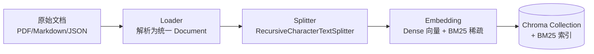
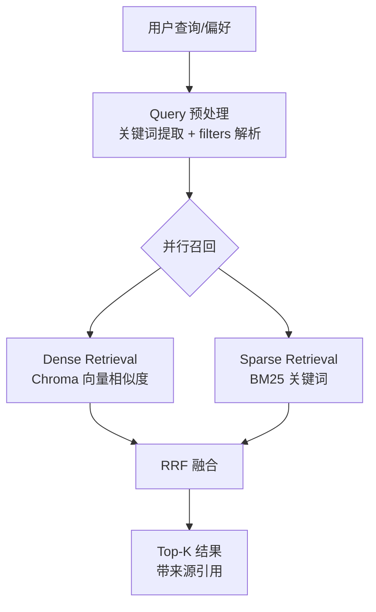
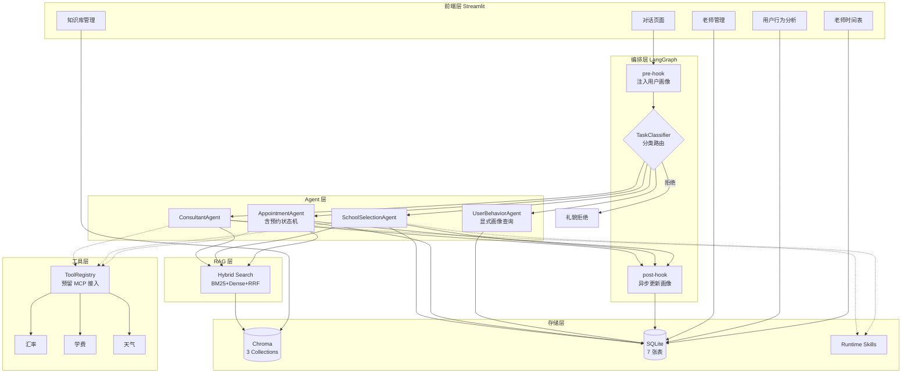
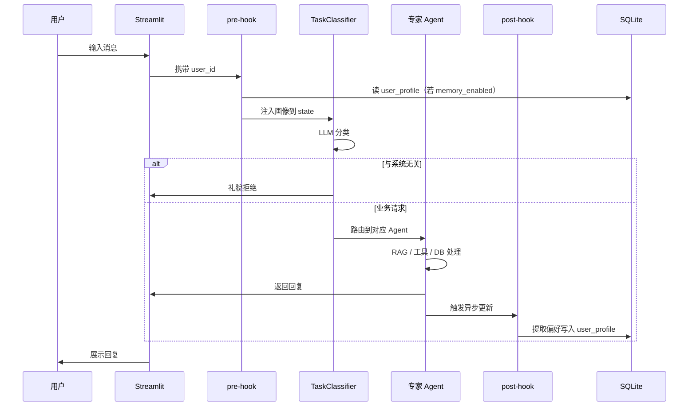
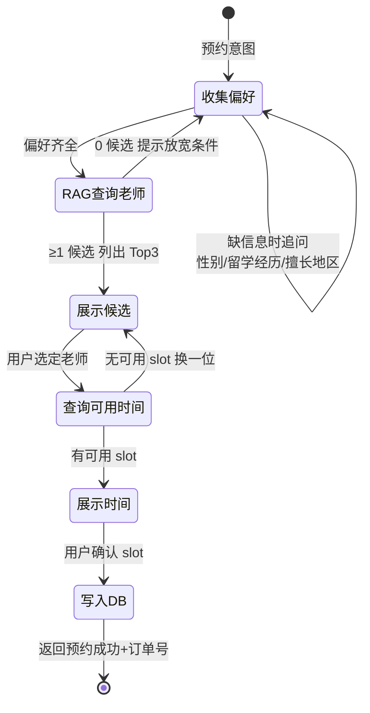
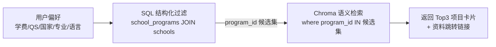
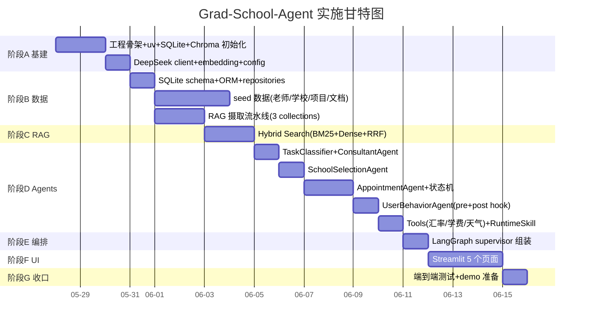

# Developer Specification (DEV_SPEC)

> 项目：**Grad-School-Agent — 申研选校预约系统**
> 版本：1.0
> 更新时间：2026-05-27

---

## 目录

1. [项目概述](#1-项目概述)
2. [核心特点](#2-核心特点)
3. [技术选型](#3-技术选型)
4. [系统架构与模块设计](#4-系统架构与模块设计)
5. [数据库设计](#5-数据库设计)
6. [Agent 详细设计](#6-agent-详细设计)
7. [Skills 规划](#7-skills-规划)
8. [测试方案](#8-测试方案)
9. [项目排期](#9-项目排期)
10. [可扩展性与未来展望](#10-可扩展性与未来展望)
- [附录 A：数据库 Schema 同步规范](#附录-a数据库-schema-同步规范)
- [附录 B：Seed 数据来源建议](#附录-bseed-数据来源建议)

---

## 1. 项目概述

**Grad-School-Agent** 是一个面向「出国申研选校」场景的多 Agent 智能预约与咨询系统。系统以一个对话窗口为入口，背后由多个分工明确的 Agent 协作，帮助用户完成三类核心任务：

- **咨询（Consultation）**：回答签证指南、公司介绍、服务说明等通用问题。
- **选校（School Selection）**：根据用户的结构化偏好（学费区间、QS 排名、国家、专业、语言要求等）匹配合适的学校项目，并返回可跳转的资料链接。
- **预约（Appointment）**：根据用户对咨询老师的偏好（性别、留学经历、工作经历、擅长地区/专业）匹配老师，查询其可用时间，完成预约。

系统还包含**用户行为分析**能力：在用户同意的前提下记忆其偏好画像，自动用于后续对话的个性化推荐。

### 1.1 设计定位

本项目是一个**自然语言处理课程实践项目**，定位为「可演示、可讲解、技术点清晰」，而非生产级商业系统。因此设计上遵循以下取舍：

- **优先保证主流程跑通**：对话 → 分类 → 子 Agent 处理 → 返回结果的端到端闭环。
- **突出 NLP/Agent 技术点**：LangGraph 多 Agent 编排、Hybrid RAG（BM25 + Dense + RRF）、插件化 Runtime Skills。
- **不做工程过度设计**：不涉及部署、打包、微服务、CI/CD、性能压测。
- **本地优先（Local-First）**：SQLite + Chroma 本地存储，`uv` 一键装环境即可运行。

### 1.2 与 Baseline 的关系

本项目以开源项目 **smart-appointment-ai-agent**（按摩智能预约系统）为 baseline 进行重构。复用其经过验证的工程骨架：

| Baseline 资产 | 在本项目中的处理 |
|--------------|----------------|
| `agents/`（task_classification / appointment / consultant / user_behavior） | 重构并适配，新增 SchoolSelectionAgent（共 5 个核心 Agent + 工具层） |
| `services/` 业务服务分层 | 保留分层思想，适配选校/预约场景 |
| `db/repositories/` 仓储模式 | 保留，适配新的 7 张表 |
| `.github/skills/`（5 个 Copilot Skills） | 迁移并适配为 `.claude/skills/` 下的 Claude Code Skills |
| Flask `web/` 前端 | 替换为 Streamlit 多页面 |

### 1.3 名词约定

| 术语 | 含义 |
|------|------|
| Agent | 一个有明确职责的对话处理单元，可调用 LLM / RAG / 工具 / 数据库 |
| Supervisor | LangGraph 中的顶层编排图，负责路由与状态管理 |
| Collection | Chroma 向量库中的一个独立集合（本项目有 3 个） |
| Runtime Skill | 系统运行时由 Agent 调用的领域知识插件（如「美国留学常识」） |
| Dev Skill | Claude Code 在开发期使用的辅助 skill，位于 `.claude/skills/` |

---

## 2. 核心特点

### 2.1 多 Agent 协作架构（LangGraph）

系统采用 **LangGraph** 构建状态图（State Graph）编排多个 Agent：

- **统一入口**：TaskClassifier 作为 supervisor 的第一站，对用户输入进行任务分类，路由到对应的专家 Agent；与本系统无关的请求被礼貌拒绝。
- **专家分工**：Consultant / SchoolSelection / Appointment 各司其职，互不耦合。
- **横切关注点（Cross-cutting）**：用户行为分析以 pre-hook（对话前注入画像）+ post-hook（对话后异步更新画像）的形式贯穿所有对话，而非一个孤立的 Agent。
- **共享工具子图**：汇率换算、学费估算、天气查询等工具以 LangChain Tool 形式注册，任何专家 Agent 都可调用。

### 2.2 Hybrid RAG 检索

针对选校、预约老师、咨询查文档三类检索需求，统一采用**混合检索**策略：

- **Sparse Retrieval（BM25）**：关键词精确匹配，解决专有名词（如学校简称、专业代码）查找问题。
- **Dense Retrieval（Embedding）**：语义向量匹配，解决「词不同意同」的模糊表达问题。
- **RRF 融合（Reciprocal Rank Fusion）**：基于排名倒数融合两路结果，平衡查全率与查准率。
- **结构化预过滤**：选校场景先用 SQL 按学费/QS/国家硬过滤，再在候选集内做语义检索，显著降低噪音。

### 2.3 插件化 Runtime Skills（项目亮点）

系统提供 **Runtime Skill 机制**，允许将领域知识封装为独立、可插拔的模块：

- 每个 Runtime Skill 实现统一接口（`name` / `description` / `match()` / `provide_context()`）。
- 专家 Agent 在生成回答前查询 SkillRegistry，命中的 Skill 将额外知识/规则注入 prompt。
- 体现**插件化思想与工程可扩展性**：未来新增「美国留学常识」「英国 PSW 政策」等 Skill 无需修改 Agent 代码。

### 2.4 可观测、可个性化的对话

- **对话可观测**：每条消息记录由哪个 Agent 生成，便于调试与 demo 讲解。
- **偏好可记忆、可关闭**：用户可通过 UI 开关控制是否记忆个人偏好（类似常见软件的「记住我的偏好」），尊重隐私。
- **一键清空**：清空对话时同步清除用户画像。

---

## 3. 技术选型

### 3.1 LangGraph 多 Agent 编排

**选型：LangGraph（基于 LangChain）**

- **为什么用 LangGraph 而非简单路由**：
  - 多 Agent 协作与状态传递天然由 Graph State 管理，避免手动传参的混乱。
  - pre-hook / post-hook 作为图中的 node，让「用户画像注入」这类横切逻辑优雅落地。
  - 预约机器人的多轮状态机可用 subgraph 封装，状态可追溯。
- **核心概念映射**：

| LangGraph 概念 | 本项目用途 |
|---------------|----------|
| `StateGraph` | 顶层 supervisor 编排图 |
| `State`（TypedDict） | 在 node 间传递的对话状态（见 4.4） |
| `Node` | 每个 Agent / hook 包装为一个 node |
| `Conditional Edge` | TaskClassifier 的路由决策 |
| `Subgraph` | AppointmentAgent 的预约状态机 |

### 3.2 RAG 流水线

#### 3.2.1 知识库组织（3 个 Collection）

```
Chroma (data/chroma/)
├── schools         # 学校长文介绍 + 项目详细描述 + 申请要求
├── teachers        # 老师简介、留学/工作经历、擅长方向（自由文本）
└── internal_docs   # 签证指南、公司介绍、服务说明、营业信息
```

每个 chunk 的 metadata 携带来源标识（如 `school_id` / `program_id` / `teacher_id` / `doc_type`），检索命中后可回链 SQLite 取结构化数据。

#### 3.2.2 数据摄取流水线（Ingestion）



- **Loader**：PDF 用 `pypdf`/`MarkItDown`，结构化数据（老师/学校）用自定义 JSON/CSV loader 直接转 Document。
- **Splitter**：LangChain `RecursiveCharacterTextSplitter`，对 Markdown 结构友好。
- **Embedding**：Dense 向量用 DeepSeek/BGE embedding；Sparse 用 BM25（`rank_bm25` 库）。

#### 3.2.3 检索流水线（Retrieval）



- **融合算法**：RRF，`Score = 1/(k + rank_dense) + 1/(k + rank_sparse)`，`k` 默认 60。
- **不做 Reranker**：课程项目范围内，Hybrid + RRF 已足够；架构上预留 reranker 接入点。

### 3.3 LLM / Embedding / 工具调用

| 组件 | 选型 | 说明 |
|------|------|------|
| LLM | **DeepSeek API** | 兼容 OpenAI SDK，国内访问稳定、成本低、中文效果好 |
| Embedding | DeepSeek Embedding 或本地 **BGE-small-zh** | 可配置切换；本地 BGE 零成本、离线可用 |
| 工具调用 | **LangChain Tool（in-process）** | `@tool` 装饰函数，Agent 通过 function calling 调用 |
| 工具扩展点 | **ToolRegistry 抽象** | 保留 MCP Server 接入抽象，本期不实现 MCP |

工具清单（初期）：

| 工具 | 功能 | 数据来源 |
|------|------|---------|
| `currency_convert` | 汇率换算（USD/GBP/CNY 等） | 实时汇率 API（可降级为静态汇率表） |
| `tuition_estimate` | 学费估算（结合汇率 + 项目学制） | 调用 currency_convert + SQLite |
| `weather_query` | 查询城市天气 | 天气 API（可降级） |

> **降级策略**：外部 API 不可用时回退到静态数据，保证 demo 不中断。

### 3.4 SQLite 数据模型

采用 **SQLite + SQLAlchemy ORM**，本地单文件 `data/grad_school.db`。共 7 张表（详见第 5 章）。选 SQLite 的理由：零依赖部署、`uv` 装好即用、并发场景（单用户 demo）完全够用。

### 3.5 Streamlit 前端

**选型：Streamlit 多页面应用（Multi-Page App）**

- Python 单语言，几十行即可搭出交互界面，课程 presentation 友好。
- 5 个页面（见 4.2 目录结构与 6.x）：对话 / 知识库管理 / 老师管理 / 用户行为分析 / 老师时间表。
- 对话状态用 `st.session_state` 管理，与 LangGraph 的 State 对接。

### 3.6 Runtime Skills 插件机制

**目标**：将领域知识与对话逻辑解耦，支持「乐高式」扩展。

- **接口契约**（`src/runtime_skills/base.py`）：

```python
class BaseRuntimeSkill(ABC):
    name: str
    description: str

    @abstractmethod
    def match(self, query: str, context: dict) -> bool:
        """判断当前 skill 是否适用于该查询。"""

    @abstractmethod
    def provide_context(self, query: str, context: dict) -> str:
        """返回要注入 prompt 的额外知识/规则文本。"""
```

- **注册机制**：`SkillRegistry` 自动发现 `src/runtime_skills/` 下所有 skill，Agent 调用 `registry.collect_context(query, context)` 获取所有命中 skill 的注入内容。
- **示例 Skill**：`us_visa_knowledge`（美国签证常识）、`application_timeline`（申请时间线常识）。

---

## 4. 系统架构与模块设计

### 4.1 整体架构图



### 4.2 目录结构

```
Grad-School-Agent/
├── app.py                          # Streamlit 入口
├── pyproject.toml                  # uv 项目配置
├── requirements.txt                # 依赖（兼容 pip）
├── .env.example                    # DeepSeek API key 等模板
├── README.md
├── DEV_SPEC.md                     # 本文档
│
├── config/
│   ├── settings.yaml               # LLM / RAG / DB 配置
│   └── prompts/                    # 各 Agent 的 Prompt 模板
│       ├── task_classifier.txt
│       ├── consultant.txt
│       ├── school_selection.txt
│       ├── appointment.txt
│       └── user_behavior.txt
│
├── src/
│   ├── agents/                     # 多 Agent 实现
│   │   ├── __init__.py
│   │   ├── base_agent.py           # Agent 抽象基类
│   │   ├── task_classifier.py
│   │   ├── consultant_agent.py
│   │   ├── school_selection_agent.py
│   │   ├── appointment_agent.py
│   │   └── user_behavior_agent.py
│   │
│   ├── graph/                      # LangGraph 编排
│   │   ├── __init__.py
│   │   ├── state.py                # GraphState TypedDict
│   │   ├── supervisor.py           # 顶层 supervisor 图
│   │   ├── hooks.py                # pre/post hook 节点
│   │   └── appointment_graph.py    # 预约状态机 subgraph
│   │
│   ├── rag/                        # RAG 系统
│   │   ├── __init__.py
│   │   ├── ingestion/
│   │   │   ├── loaders.py          # PDF/Markdown/JSON loader
│   │   │   ├── splitter.py
│   │   │   └── pipeline.py
│   │   ├── retrieval/
│   │   │   ├── dense_retriever.py
│   │   │   ├── sparse_retriever.py # BM25
│   │   │   ├── hybrid_search.py    # RRF 融合
│   │   │   └── retriever_factory.py
│   │   └── collections.py          # 3 collection 初始化
│   │
│   ├── tools/                      # 工具层
│   │   ├── __init__.py
│   │   ├── registry.py             # ToolRegistry（预留 MCP 接入点）
│   │   ├── currency_tool.py
│   │   ├── tuition_tool.py
│   │   └── weather_tool.py
│   │
│   ├── runtime_skills/             # 运行时领域 skill（项目亮点）
│   │   ├── __init__.py
│   │   ├── base.py                 # BaseRuntimeSkill 接口
│   │   ├── registry.py             # SkillRegistry 自动发现
│   │   ├── README.md               # skill 编写规范
│   │   └── us_visa_knowledge/      # 示例 skill
│   │
│   ├── db/                         # 数据层
│   │   ├── __init__.py
│   │   ├── models.py               # SQLAlchemy ORM（字段带 comment）
│   │   ├── init_db.py              # 建表 + seed 导入
│   │   └── repositories/
│   │       ├── teacher_repo.py
│   │       ├── school_repo.py
│   │       ├── appointment_repo.py
│   │       ├── user_repo.py
│   │       └── conversation_repo.py
│   │
│   ├── services/                   # 业务服务层
│   │   ├── chat_service.py
│   │   ├── knowledge_service.py
│   │   ├── teacher_service.py
│   │   └── user_behavior_service.py
│   │
│   ├── llm/                        # LLM 调用层
│   │   ├── deepseek_client.py
│   │   └── embedding_client.py
│   │
│   └── utils/
│       ├── logger.py
│       └── config_loader.py
│
├── ui/                             # Streamlit 页面
│   ├── pages/
│   │   ├── 1_对话.py
│   │   ├── 2_知识库管理.py
│   │   ├── 3_老师管理.py
│   │   ├── 4_用户行为分析.py
│   │   └── 5_老师时间表.py
│   └── components/
│       ├── chat_box.py
│       └── kb_uploader.py
│
├── .claude/                        # Claude Code 开发期 skills
│   ├── skills/
│   │   ├── setup-environment/
│   │   ├── project-learner/
│   │   ├── skill-creator/
│   │   ├── resume-writer/
│   │   ├── interview-prep/
│   │   ├── grad-school-rag/
│   │   ├── grad-school-agent/
│   │   ├── grad-school-db/
│   │   └── grad-school-eval/
│   └── commands/
│
├── data/
│   ├── chroma/                     # 3 个 collection
│   ├── grad_school.db              # 主 SQLite
│   ├── raw_docs/                   # 原始知识库文档
│   │   ├── schools/
│   │   ├── teachers/
│   │   └── internal/
│   └── seed/                       # 种子数据（CSV/JSON）
│       ├── teachers.json
│       ├── schools.json
│       └── programs.json
│
├── tests/
│   ├── unit/
│   └── integration/
│
└── docs/
    ├── DB_SCHEMA.md                # 数据库字段文档（实时维护）
    ├── SEED_DATA.md                # seed 数据来源说明
    └── superpowers/specs/          # brainstorming 设计文档
```

### 4.3 模块职责说明

| 模块 | 职责 | 关键技术点 |
|------|------|----------|
| `agents/base_agent.py` | Agent 抽象基类，统一 `run(state) -> state` 接口 | 模板方法模式 |
| `agents/task_classifier.py` | 任务分类，输出 `consultant/school/appointment/behavior/reject` | LLM few-shot 分类 |
| `graph/supervisor.py` | 顶层编排，组装 node 与 conditional edge | LangGraph StateGraph |
| `graph/hooks.py` | pre-hook 注入画像、post-hook 异步更新 | 横切关注点 |
| `graph/appointment_graph.py` | 预约多轮状态机 | LangGraph Subgraph |
| `rag/retrieval/hybrid_search.py` | Dense + Sparse 并行召回 + RRF | 混合检索 |
| `tools/registry.py` | 工具注册与调用，预留 MCP 接入抽象 | Registry 模式 |
| `runtime_skills/registry.py` | 自动发现并聚合 runtime skill 注入内容 | 插件机制 |
| `db/repositories/*` | 数据访问层，隔离 ORM 细节 | Repository 模式 |
| `services/*` | 业务编排，被 Agent 与 UI 共用 | 服务分层 |

### 4.4 关键数据流

#### 4.4.1 GraphState 定义

LangGraph 在 node 间传递的状态：

```python
class GraphState(TypedDict):
    user_id: int
    conversation_id: int
    user_input: str               # 当前用户输入
    user_profile: dict            # pre-hook 注入的画像
    memory_enabled: bool          # 是否启用偏好记忆
    task_type: str                # classifier 输出：consultant/school/...
    messages: list                # 对话历史（会话内）
    agent_response: str           # 当前 agent 的回复
    # 预约状态机专用字段
    appointment_slots: dict       # preferences/candidates/selected_teacher/...
```

#### 4.4.2 对话主流程



#### 4.4.3 预约状态机



#### 4.4.4 选校两段式检索



---

## 5. 数据库设计

### 5.1 ER 图

```mermaid
erDiagram
    users ||--o{ conversations : has
    users ||--o{ appointments : books
    users ||--|| user_profile : "has 1"
    teachers ||--o{ appointments : "booked into"
    teachers ||--o{ teacher_schedule : "has slots"
    conversations ||--o{ messages : contains
    schools ||--o{ school_programs : "has many"
    school_programs ||--o{ appointments : "optional topic ref"

    users {
        int id PK
        string username
        string created_at
    }
    user_profile {
        int user_id PK_FK
        json preferences
        bool memory_enabled
        string updated_at
    }
    conversations {
        int id PK
        int user_id FK
        string started_at
    }
    messages {
        int id PK
        int conversation_id FK
        string role
        string agent_name
        text content
        string created_at
    }
    teachers {
        int id PK
        string name
        string gender
        text bio
        string study_abroad
        string work_experience
        string expertise_regions
        string expertise_majors
    }
    teacher_schedule {
        int id PK
        int teacher_id FK
        string date
        string time_slot
        string status
    }
    appointments {
        int id PK
        int user_id FK
        int teacher_id FK
        int schedule_id FK
        string topic
        string status
        string created_at
    }
    schools {
        int id PK
        string name
        string short_name
        string country
        int qs_rank
        string official_site
        text intro
        string created_at
    }
    school_programs {
        int id PK
        int school_id FK
        string program_full_name
        string program_short_name
        string major_category
        int duration_months
        float tuition_per_year
        string currency
        float ielts_min
        float toefl_min
        string deadline
        text description_short
        string created_at
    }
```

### 5.2 表结构详解

> 完整字段含义、取值范围与示例见 [`docs/DB_SCHEMA.md`](docs/DB_SCHEMA.md)（随 schema 变更实时维护，见附录 A）。下表为概览。

| 表名 | 用途 | 关键字段 |
|------|------|---------|
| `users` | 用户基础信息 | `username` |
| `user_profile` | 用户偏好画像 | `preferences`(json)、`memory_enabled` |
| `conversations` | 会话记录 | `user_id` |
| `messages` | 单条消息 | `role`、`agent_name`、`content` |
| `teachers` | 咨询老师信息 | `gender`、`study_abroad`、`expertise_regions`、`expertise_majors` |
| `teacher_schedule` | 老师可预约时间槽 | `date`、`time_slot`、`status`(available/booked/blocked) |
| `appointments` | 预约订单 | `user_id`、`teacher_id`、`schedule_id`、`status` |
| `schools` | 学校（父级） | `name`、`short_name`、`country`、`qs_rank` |
| `school_programs` | 学校项目（子级） | `tuition_per_year`、`duration_months`、`ielts_min`、`toefl_min` |

### 5.3 数据分布策略（SQLite vs Chroma）

| 数据 | 存储 | 理由 |
|------|------|------|
| 学校/项目结构化字段 | SQLite | 需按 QS/学费/语言分数精确过滤 |
| 老师结构化字段 | SQLite | 预约写入、状态更新 |
| 学校长文介绍、项目详述 | Chroma (schools) | 自由文本，语义检索 |
| 老师简介自由文本 | Chroma (teachers) | 偏好语义匹配 |
| 签证指南/公司介绍等 | Chroma (internal_docs) | 文档问答 |

---

## 6. Agent 详细设计

每个 Agent 继承 `BaseAgent`，实现 `run(state: GraphState) -> GraphState`。

### 6.1 TaskClassifier（分类机器人）

- **职责**：将用户输入分类为 `consultant` / `school` / `appointment` / `behavior` / `reject`。
- **输入**：`user_input` + `user_profile`（辅助消歧）。
- **输出**：`task_type`。
- **实现**：LLM few-shot 分类 prompt，给出每类的典型示例；置信度低或与留学/选校/预约无关时归为 `reject`。
- **拒绝示例**："今天股市怎么样" → reject，回复"我是申研选校助手，仅能协助选校、咨询与预约老师"。

### 6.2 ConsultantAgent（咨询机器人）

- **职责**：回答签证、公司、服务等通用问题。
- **检索**：Hybrid Search on `internal_docs`。
- **增强**：查询 SkillRegistry，命中的 Runtime Skill（如 `us_visa_knowledge`）注入额外上下文。
- **输出**：带来源引用的回答。

### 6.3 SchoolSelectionAgent（选校机器人）

- **职责**：多轮收集结构化偏好 → 两段式检索 → 返回项目卡片。
- **偏好字段**：学费区间、QS 范围、国家、专业大类、学制、语言要求。
- **检索**：先 SQL 过滤 `school_programs`，再在候选集做 Chroma 语义检索。
- **工具**：可调用 `tuition_estimate`（结合汇率换算学费）。
- **输出**：Top3 项目卡片（学校简称 + 项目全称 + 学费 + 学制 + 语言要求 + 资料跳转链接）。

### 6.4 AppointmentAgent（预约机器人）

- **职责**：多轮收集老师偏好 → 匹配老师 → 查可用时间 → 写入预约。
- **实现**：LangGraph subgraph 状态机（见 4.4.3）。
- **检索**：Hybrid Search on `teachers`（按性别/留学经历/擅长地区/专业匹配）。
- **数据库**：读 `teacher_schedule`（available slot），写 `appointments` 并更新 slot 状态为 `booked`。
- **输出**：预约成功确认 + 订单号。

### 6.5 UserBehaviorAgent（用户行为分析机器人）

- **职责（方案 C）**：
  - **pre-hook**：对话前从 `user_profile` 读画像注入 state（受 `memory_enabled` 控制）。
  - **post-hook**：对话后异步用 LLM 从本轮对话提取偏好关键词，更新 `user_profile`。
  - **显式入口**：用户主动问"分析我的偏好"时，由 classifier 路由到本 Agent，渲染画像。
- **数据库**：读写 `user_profile`、读 `conversations`/`messages`。
- **隐私**：`memory_enabled=false` 时 pre/post hook 全部跳过。

### 6.6 工具层（ToolRegistry）

- 不是独立 Agent，而是共享工具集，由专家 Agent 通过 function calling 调用。
- `registry.py` 提供统一注册/查找接口，预留 MCP Server 接入抽象（本期 in-process 实现）。

---

## 7. Skills 规划

本项目区分两类 skill，位置与用途严格分离：

| 类别 | 位置 | 服务对象 | 是否随系统运行 |
|------|------|---------|--------------|
| Dev Skill | `.claude/skills/` | Claude Code（开发期） | 否 |
| Runtime Skill | `src/runtime_skills/` | 系统 Agent（运行时） | 是 |

### 7.1 Dev Skills（`.claude/skills/`，9 个）

| Skill | 来源 | 用途 |
|------|------|------|
| `setup-environment` | baseline 迁移 | 检查 uv → 装依赖 → 配 .env → 初始化 DB/Chroma |
| `project-learner` | baseline 迁移 | 帮助快速理解本项目架构 |
| `skill-creator` | baseline 迁移 | 在本项目内创建新 skill |
| `resume-writer` | baseline 迁移 | 把项目写进简历 |
| `interview-prep` | baseline 迁移 | 围绕 LangGraph/RAG/多 Agent 出面试题 |
| `grad-school-rag` | 新增 | 调试 RAG 检索效果（查 chunk、调参） |
| `grad-school-agent` | 新增 | 调试 Agent prompt + 路由测试 |
| `grad-school-db` | 新增 | SQLite schema 设计与迁移 + 同步 DB_SCHEMA.md |
| `grad-school-eval` | 新增 | 对话效果评估（golden set + LLM-as-judge） |

### 7.2 Runtime Skills（`src/runtime_skills/`）

- **机制**：见 3.6。统一接口 + 自动注册 + Agent 调用时聚合注入。
- **初期示例**：`us_visa_knowledge`（美国签证常识）。
- **扩展示例（未来亮点）**：`uk_psw_policy`、`application_timeline`、`scholarship_guide` 等。
- `src/runtime_skills/README.md` 记录编写规范与注册方式。

---

## 8. 测试方案

课程项目采用**简化测试金字塔**，重点保证主流程可用，不追求覆盖率指标。

| 层级 | 范围 | 工具 |
|------|------|------|
| 单元测试 | Agent prompt 渲染、Tools 函数、RRF 融合、BM25 检索、Repository CRUD | `pytest` + mock LLM |
| 集成测试 | LangGraph 端到端：用户输入 → 最终回复（含路由正确性） | `pytest` + 少量真实 LLM |
| 人工验证 | ~10 个典型对话脚本（每个 Agent + 拒绝场景 + 预约完整流程） | Streamlit 手动 demo |

**显式不做**：自动化 RAG 评估（Ragas）、性能/压力测试、CI/CD。架构上预留 `grad-school-eval` skill 作为未来扩展。

**关键测试场景清单**：

1. 分类正确性：咨询/选校/预约/无关请求各 2 例。
2. 选校两段式：给定偏好能返回符合学费/QS 约束的项目。
3. 预约完整流程：偏好收集 → 选老师 → 选时间 → 写入成功。
4. 偏好记忆：开启后跨轮注入生效；关闭后不记忆。
5. 工具调用：学费换算结果正确。
6. RAG 检索：BM25 命中学校简称、Dense 命中语义近义表达。

---

## 9. 项目排期

> **排期原则**：
> - 严格对齐第 4.2 节目录结构，每阶段在文件系统产生可见交付。
> - 数据准备（seed 数据）与代码开发可并行：用户负责数据整理，开发负责代码。
> - 优先打通端到端主闭环，再补齐细节。
> - 总工期 ~22 人天，落在 2-4 周窗口，留 buffer。

### 9.1 甘特图



### 9.2 进度跟踪表

> 状态：`[ ]` 未开始 | `[~]` 进行中 | `[x]` 已完成

#### 阶段 A：基建

| 编号 | 任务 | 状态 | 验收标准 |
|------|------|------|---------|
| A1 | 工程骨架 + uv + SQLite + Chroma 初始化 | [ ] | `uv run app.py` 能启动 Streamlit 空壳 |
| A2 | DeepSeek client + embedding + config | [ ] | 能成功调用 LLM 返回一句话 |

#### 阶段 B：数据

| 编号 | 任务 | 状态 | 验收标准 |
|------|------|------|---------|
| B1 | SQLite schema + ORM + repositories | [ ] | 7 张表建成，CRUD 单测通过 |
| B2 | seed 数据（老师/学校/项目/文档） | [ ] | 30 老师/80 学校/200 项目/20 文档导入成功 |
| B3 | RAG 摄取流水线（3 collections） | [ ] | 3 个 collection 摄取成功，可检索 |

#### 阶段 C：RAG

| 编号 | 任务 | 状态 | 验收标准 |
|------|------|------|---------|
| C1 | Hybrid Search（BM25+Dense+RRF） | [ ] | 给定 query 返回带来源的 Top-K |

#### 阶段 D：Agents

| 编号 | 任务 | 状态 | 验收标准 |
|------|------|------|---------|
| D1 | TaskClassifier + ConsultantAgent | [ ] | 分类准确，咨询能答 |
| D2 | SchoolSelectionAgent | [ ] | 两段式检索返回合规项目 |
| D3 | AppointmentAgent + 状态机 | [ ] | 完整预约流程写入 DB |
| D4 | UserBehaviorAgent（pre+post hook） | [ ] | 偏好注入与更新生效 |
| D5 | Tools + RuntimeSkill | [ ] | 学费换算正确，skill 注入生效 |

#### 阶段 E-G

| 编号 | 任务 | 状态 | 验收标准 |
|------|------|------|---------|
| E1 | LangGraph supervisor 组装 | [ ] | 端到端路由跑通 |
| F1 | Streamlit 5 个页面 | [ ] | 5 页面均可交互 |
| G1 | 端到端测试 + demo 准备 | [ ] | 10 个场景脚本全过 |

### 9.3 风险与降级

| 风险 | 降级方案 |
|------|---------|
| 时间不足 | 先砍 weather 工具、evaluation skill；Tools 仅保留学费换算 |
| seed 数据难凑齐 | 先用小型数据打通流程，demo 前再补 |
| DeepSeek API 不稳 | embedding 切本地 BGE；LLM 配置可切其他兼容 provider |
| LangGraph 学习成本 | 顶层先用简单路由跑通，再逐步引入 hook/subgraph |

---

## 10. 可扩展性与未来展望

1. **新增 Agent**：实现 `BaseAgent` 并在 supervisor 注册 node + edge 即可。
2. **新增 Runtime Skill**：在 `src/runtime_skills/` 下按接口实现，自动被发现，无需改 Agent。
3. **新增工具**：实现 LangChain `@tool` 并在 ToolRegistry 注册；未来可升级为 MCP Server。
4. **检索增强**：在 `hybrid_search` 后接入 Cross-Encoder Reranker（已预留接入点）。
5. **评估闭环**：启用 `grad-school-eval` skill + golden test set 做回归。
6. **多用户与登录**：当前为单用户/简单用户，未来可加鉴权与会话隔离。

---

## 附录 A：数据库 Schema 同步规范

为保证数据库结构可追溯、易理解，约定如下纪律：

1. **ORM 注释**：`src/db/models.py` 中所有表和字段必须写 `comment=`，说明含义与取值范围。
2. **独立文档**：`docs/DB_SCHEMA.md` 维护每张表的字段表（字段名 / 类型 / 含义 / 取值范围 / 示例）。
3. **变更同步**：任何 schema 变更（加字段、改类型、加表）必须在同一次提交中同步更新 `DB_SCHEMA.md`，否则视为未完成。
4. **生成辅助**：可用 `grad-school-db` skill 从 ORM 自动生成基础字段表，再人工补充语义说明。

---

## 附录 B：Seed 数据来源建议

> 详见 [`docs/SEED_DATA.md`](docs/SEED_DATA.md)。量级：大型（30 老师 / 80 学校 / 200 项目 / 20 文档）。

| 数据 | 来源建议 | 格式 |
|------|---------|------|
| 老师 ~30 | LLM 批量合成 fake profiles（人工审核去重） | `data/seed/teachers.json` |
| 学校 ~80 | QS Top 100 公开信息整理（名称/国家/排名/官网） | `data/seed/schools.json` |
| 项目 ~200 | 每校 2-3 个主流项目（CS/EE/DS/MBA 等），学费/学制/语言要求 | `data/seed/programs.json` |
| 内部文档 ~20 | 签证指南用公开版（如 USCIS）；公司介绍/服务说明可合成 | `data/raw_docs/internal/*.pdf` |

> 数据准备与代码开发并行。首期可用小型数据（5 学校/3 老师/2 文档）打通流程，demo 前补足。

---

> **文档状态**：设计定稿，待用户审阅。后续实现进度在第 9.2 节进度跟踪表中更新。
