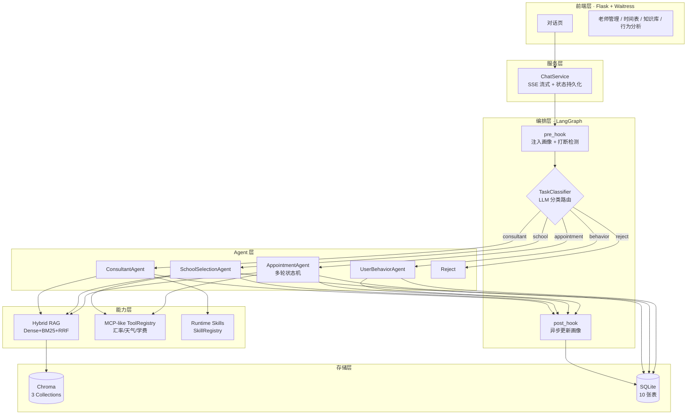
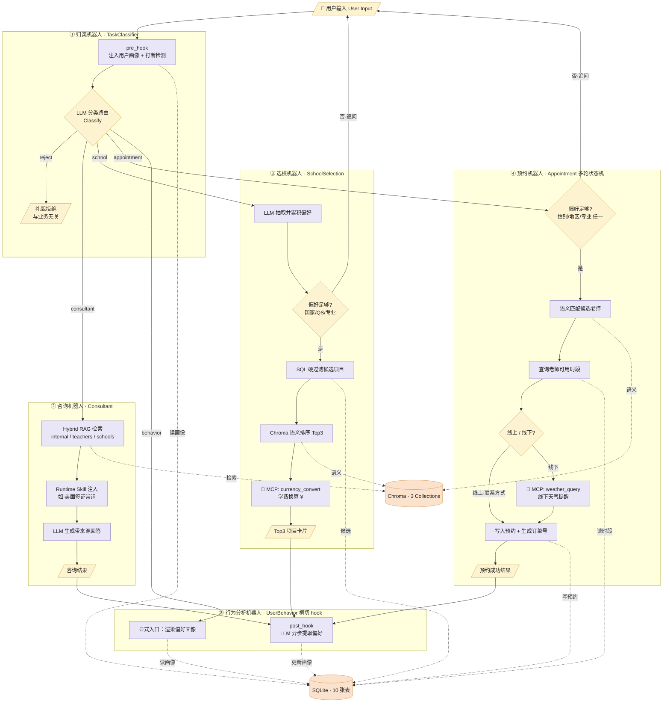
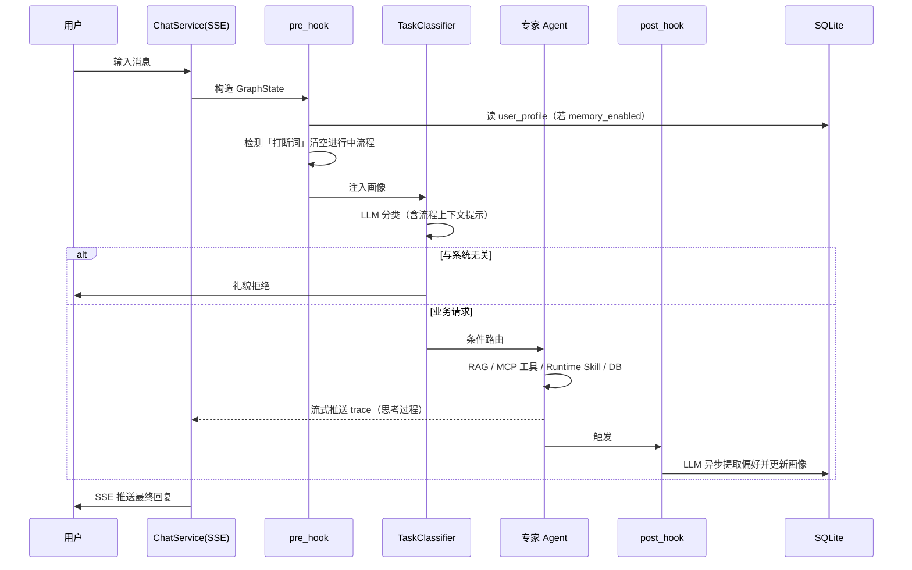
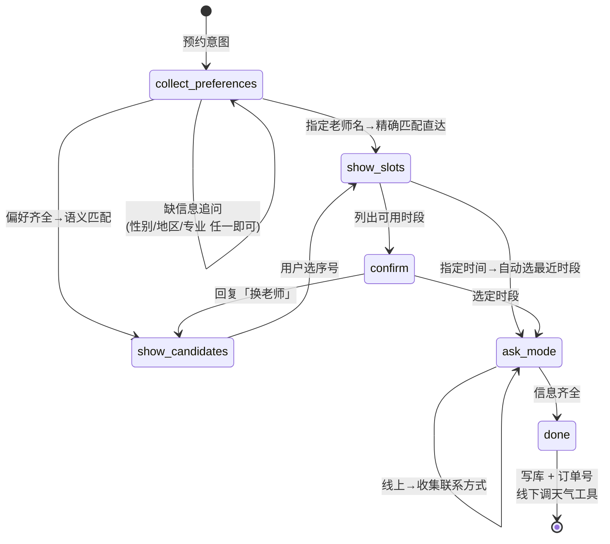
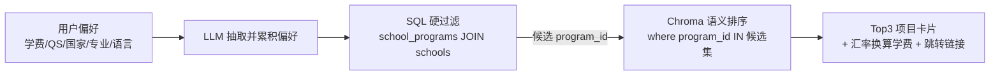

# Grad-School-Agent — 申研选校预约系统

> **自然语言处理课程设计 · 技术汇报**
> 多 Agent 协作 + Hybrid RAG + MCP-like 工具调用 + Runtime Skills 插件化

---

## 1. 项目概述

**Grad-School-Agent** 是一个面向「出国申研选校」场景的对话式智能助手。用户在一个聊天窗口中输入自然语言，背后由多个分工明确的 Agent 协作完成三类核心任务：

| 任务 | 说明 | 负责 Agent |
|------|------|-----------|
| **咨询 Consultation** | 回答签证指南、公司介绍、服务说明等通用问题 | ConsultantAgent |
| **选校 School Selection** | 按学费 / QS / 国家 / 专业 / 语言要求匹配学校项目 | SchoolSelectionAgent |
| **预约 Appointment** | 按偏好匹配咨询老师、查可用时间、完成预约 | AppointmentAgent |

系统还具备**用户行为分析**能力：在用户同意（可一键关闭）的前提下记忆偏好画像，自动用于后续个性化推荐。

**设计定位**：可演示、可讲解、NLP/Agent 技术点清晰的课程实践项目，本地优先（Local-First），一键即可运行。

---

## 2. 技术栈选型

| 层次 | 技术选型 | 选型理由 |
|------|---------|---------|
| **Agent 编排** | **LangGraph**（基于 LangChain） | 多 Agent 状态传递、条件路由、横切 hook、子图状态机天然由 Graph State 管理 |
| **大语言模型** | **DeepSeek API**（OpenAI 兼容 SDK） | 国内访问稳定、成本低、中文效果好；经统一 `BaseAgent._get_llm()` 封装（含重试、UA 代理） |
| **RAG 检索** | **Chroma**（Dense）+ **BM25/rank-bm25**（Sparse）+ **RRF 融合** | 语义匹配 + 关键词精确匹配互补，RRF 平衡查全/查准 |
| **中文分词** | **jieba** | BM25 稀疏检索的中文 tokenization |
| **Embedding** | sentence-transformers（BGE）/ DeepSeek Embedding | 可配置切换，本地 BGE 零成本离线可用 |
| **工具调用** | **MCP-like 协议**（自研 ToolRegistry） | 接口与 Anthropic MCP SDK 对齐（`list_tools` / `call_tool`），含 JSON Schema |
| **数据库** | **SQLite + SQLAlchemy ORM** | 单文件零依赖、Repository 模式隔离 ORM 细节 |
| **Web 框架** | **Flask + Waitress**（生产级 WSGI） | Waitress 解决 Windows 上 Flask dev server 的 SSE/socket bug |
| **前后端通信** | **SSE（Server-Sent Events）流式推送** | 实时把 Agent「思考过程」逐条推送到前端，可视化工作流 |
| **插件机制** | **Runtime Skills**（自研 SkillRegistry） | 领域知识与 Agent 解耦，乐高式扩展 |
| **包管理** | **uv** | 现代化 Python 包管理，`uv sync` 一键装环境 |
| **文档加载** | pypdf + markitdown | PDF / Markdown 知识库摄取 |
| **可靠性** | tenacity（重试）+ loguru（日志） | LLM / 外部 API 失败重试与可观测 |

---

## 3. 用到的 NLP 热门技术

本项目系统性地集成了当前 LLM 应用工程的多项主流技术，是技术汇报的核心看点。

### 3.1 多智能体协作（Multi-Agent Collaboration）

采用 **LangGraph StateGraph** 编排 **5 个核心 Agent**，统一继承 `BaseAgent`、实现 `run(state) -> state` 接口：

| Agent | 角色 | 核心技术点 |
|-------|------|-----------|
| **TaskClassifier**（归类机器人） | 入口路由 | LLM few-shot 分类 → `consultant / school / appointment / behavior / reject`；带「当前流程上下文提示」帮助多轮消歧 |
| **ConsultantAgent**（咨询机器人） | 文档问答 | 多库 Hybrid RAG（internal_docs + teachers + schools）+ Runtime Skill 注入 |
| **SchoolSelectionAgent**（选校机器人） | 选校匹配 | 多轮偏好累积 + **两段式检索**（SQL 硬过滤 → 语义排序）+ 汇率工具 |
| **AppointmentAgent**（预约机器人） | 预约办理 | **多轮状态机**（6 阶段）+ 老师语义匹配 + 天气工具 |
| **UserBehaviorAgent**（行为分析机器人） | 偏好画像 | **双重身份**：显式入口渲染画像 + pre/post hook 横切注入与更新 |

> **设计亮点**：用户行为分析不是孤立 Agent，而是以 **pre-hook（对话前注入画像）+ post-hook（对话后异步更新画像）** 的横切关注点（Cross-cutting Concern）贯穿所有对话。

### 3.2 LangChain / LangGraph 架构

| LangGraph 概念 | 本项目用途 |
|---------------|----------|
| `StateGraph` | 顶层 supervisor 编排图 |
| `GraphState`（TypedDict） | node 间传递的对话状态（含 `appointment_slots`、`trace` 等） |
| `Node` | 每个 Agent / hook 包装为一个节点 |
| `Conditional Edge` | TaskClassifier 的分类结果决定路由分支 |
| 多轮状态机 | AppointmentAgent 用 `current_stage` 字段驱动 6 阶段流转 |

编排链路：`pre_hook → classifier →（条件路由）→ 专家 Agent → post_hook → END`。

### 3.3 Hybrid RAG 混合检索

针对「选校 / 选老师 / 查文档」三类检索，统一采用混合检索策略：

- **Dense Retrieval**：Chroma 向量相似度，解决「词不同意同」的语义模糊查询。
- **Sparse Retrieval**：BM25（jieba 中文分词），解决学校简称、专业代码等专有名词精确匹配。
- **RRF 融合**：`score(d) = Σ 1 / (k + rank_i(d))`，`k=60`，按排名倒数融合两路结果。
- **3 个 Collection**：`schools` / `teachers` / `internal_docs`，每个 chunk 的 metadata 携带 `school_id / program_id / teacher_id` 等，命中后回链 SQLite 取结构化数据。
- **两段式检索（选校亮点）**：先用 SQL 按学费/QS/语言分数**硬过滤**得到候选 `program_id`，再在候选集内做 Chroma 语义排序（`where program_id IN [...]`），显著降噪。
- **优雅降级**：BM25 索引缺失 → 仅 Dense；向量检索失败 → 回退 SQL 顺序，保证对话不中断。

### 3.4 MCP 工具调用（MCP-like Protocol）

自研一个**轻量级 MCP（Model Context Protocol）兼容**的工具注册与调用层，接口与 Anthropic MCP Python SDK 完全对齐：

- `registry.list_tools()` → 返回 `[{name, description, inputSchema}]`（JSON Schema，可直接喂给 LLM function-calling）
- `registry.call_tool(name, **args)` → 同步调用并返回 dict
- 对外暴露标准 HTTP 端点：`GET /api/mcp/tools`、`POST /api/mcp/call/<name>`
- in-process 模式（与 Flask 同进程），**预留零改造升级为独立进程 + stdio transport（真正 MCP server）的接入点**

**内置 3 个工具**：

| 工具 | 功能 | 调用场景 |
|------|------|---------|
| `currency_convert` | 实时汇率换算（open.er-api.com，失败回退静态表） | 选校卡片把学费换算成 ¥ |
| `weather_query` | 实时天气（wttr.in，失败回退 OpenWeather） | 线下预约提示当日天气 |
| `tuition_estimate` | 估算项目总学费（含汇率换算） | 学费估算 |

> 每次工具调用都会向 SSE trace 推送 `📡 [MCP] 调用工具 ...`，在前端可视化工作流中可见。

### 3.5 Skill：双层 Skill 体系

项目区分两类 skill，位置与用途严格分离：

| 类别 | 位置 | 服务对象 | 是否随系统运行 |
|------|------|---------|--------------|
| **Runtime Skill** | `src/runtime_skills/` | 系统 Agent（运行时） | ✅ 是 |
| **Dev Skill** | `.claude/skills/` | Claude Code（开发期） | ❌ 否 |

**Runtime Skill 插件机制（项目亮点）**：

- 统一接口契约 `BaseRuntimeSkill`：`name` / `description` / `match(query, ctx)` / `provide_context(query, ctx)`
- `SkillRegistry` **自动发现** `src/runtime_skills/` 下所有子包并注册
- Agent 生成回答前调用 `skill_registry.collect_context(query, state)`，命中的 Skill 把额外知识注入 prompt
- 示例：`us_visa_knowledge`（命中「美国 + 签证/F1/DS-160」关键词时注入 F-1 签证流程知识）
- **扩展无需改 Agent 代码**：新增「英国 PSW 政策」「申请时间线」等 Skill 即插即用

---

## 4. 系统架构

分为 **前端层 / 服务层 / 编排层 / Agent 层 / 能力层 / 存储层** 六层：

**存储设计**：SQLite 共 **10 张表**（users / user_profile / conversations / **conversation_state** / messages / teachers / teacher_schedule / appointments / schools / school_programs）。其中 `conversation_state` 跨 turn 持久化 `appointment_slots` 与选校偏好，支撑多轮状态机。

**可观测性**：SSE 把每个 Agent 的 `trace`（如「正在向量库检索老师…」「📡 [MCP] 调用工具…」）实时推送到前端，对话过程透明可讲解，对 demo 极友好。

---

## 5. 多 Agent 工作流

### 5.1 多 Agent 架构工作流总图

> 仿泳道（Swimlane）流程图：每个 Agent 一条泳道，黄色=输入/输出/判定，紫色=处理步骤，圆柱=存储。

**与 baseline 示意图的关键差异**：① 新增**选校机器人**（两段式检索）；② 工具调用统一走 **MCP-like 协议**（天气/汇率/学费）；③ **行为分析不是定时推送问候的独立 Agent**，而是 `pre_hook` 注入画像 + `post_hook` 异步更新画像的**横切关注点**，贯穿所有对话。

### 5.2 对话主流程

### 5.3 预约状态机（AppointmentAgent，6 阶段）

**关键能力**：
- **跨轮持久化**：状态机的 `appointment_slots` 经 `conversation_state` 表跨 turn 保存。
- **个性化兜底**：本轮无偏好时，从 `user_profile.teacher_prefs` 注入历史偏好（行为分析机器人协作）。
- **指定老师/时间直达**：识别「约张老师」「6月5日」等表达，跳过中间环节。
- **线上/线下分支**：线上收集联系方式；线下调 `weather_query` 给当日天气提醒。
- **打断机制**：「算了 / 换个话题 / 取消预约」等关键词强制清空进行中流程并重新分类。

### 5.4 选校两段式检索（SchoolSelectionAgent）

偏好可多轮累积并持久化（写回 `user_profile.school_prefs`，下一轮 pre_hook 自动加载）；命中具体学校名（斯坦福 / MIT）时按 `school_id` 强约束直达。

---

## 6. 技术亮点小结（汇报金句）

1. **真·多智能体编排**：LangGraph StateGraph + 条件路由 + pre/post hook 横切，而非简单 if-else 路由。
2. **Hybrid RAG 工业级方案**：Dense + Sparse(BM25/jieba) + RRF 融合，叠加「SQL 硬过滤 → 语义排序」两段式检索降噪。
3. **MCP-like 工具协议**：接口对齐 Anthropic MCP SDK，含 JSON Schema 与 HTTP 端点，预留升级真 MCP server 的能力。
4. **插件化 Runtime Skills**：领域知识与 Agent 解耦，自动发现 + 命中注入，新增知识零改 Agent 代码。
5. **可观测工作流**：SSE 流式推送每个 Agent 的思考链路，对话过程全程透明，演示友好。
6. **多轮状态持久化**：`conversation_state` 表支撑预约状态机与选校偏好跨 turn，体现对话系统工程深度。
7. **全链路优雅降级**：LLM / 向量库 / 外部 API 失败均有兜底，保证 demo 不中断。

---

> **一句话定位**：本项目用 **LangGraph 多 Agent + Hybrid RAG + MCP-like 工具 + Runtime Skills 插件** 四大主流 LLM 应用技术，搭建了一个端到端可演示、可观测、可扩展的申研选校预约智能体系统。
