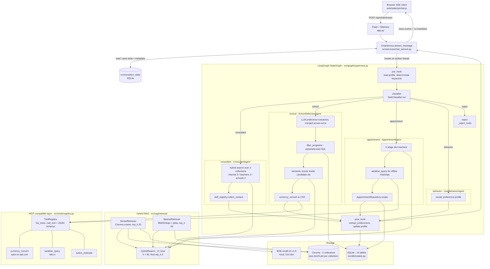
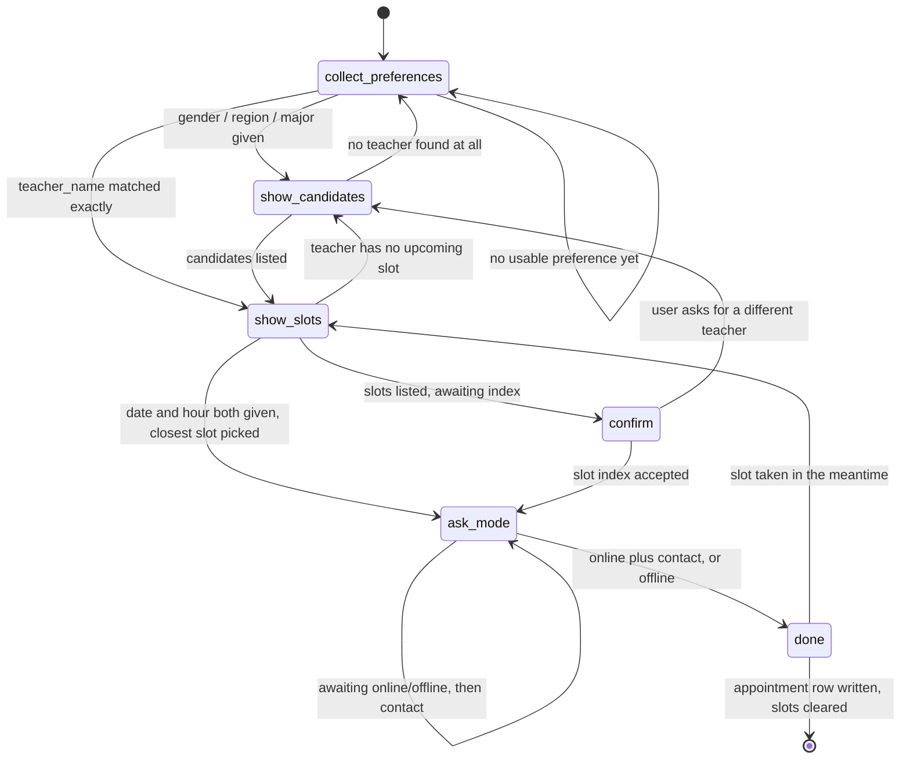

# Grad-School-Agent

**English** | [简体中文](README.zh-CN.md)

A LangGraph multi-agent assistant that answers study-abroad questions, shortlists master's programs, and books advisor appointments from a single chat window.


## Overview

Applying to graduate school is an information-retrieval problem wearing a conversation's clothes: the requirements live in policy documents, the candidate programs live in a relational table, and the advisor's calendar lives somewhere else again. A single retrieval-augmented chatbot handles the first of those three well and the other two badly.

This project splits the work across five agents orchestrated by a LangGraph `StateGraph`. A classifier routes each turn to a consultant (document QA), a school-selection agent (structured filtering plus semantic reranking), an appointment agent (a six-stage slot-filling state machine), or a behaviour agent (preference profile) — and rejects out-of-scope requests. Retrieval is hybrid (BM25 + dense, fused by RRF), tool calls go through an MCP-compatible registry, and every step of the graph streams to the browser over SSE so the reasoning path is visible rather than implied.

It was built as an NLP coursework project, so the scope is deliberately local-first: SQLite, on-disk Chroma, a local embedding model, `uv sync` and run. No deployment, no CI, no load testing.

## Key Features

- **8-node `StateGraph` with a 5-way conditional route** — `pre_hook` → `classifier` → one of `{consultant, school, appointment, behavior, reject}` → `post_hook` → `END` (`src/graph/supervisor.py`), with the preference-memory hooks as graph nodes rather than agent-internal calls.
- **Hybrid retrieval with RRF** — BM25Okapi over jieba tokens and BGE-small-zh-v1.5 dense vectors in Chroma, each returning 20 candidates, fused by `1/(k + rank)` with `k = 60` down to a top-5 (`src/rag/retrieval/hybrid_search.py`, `config/settings.yaml`).
- **Two-stage program retrieval** — parameterized SQL over `school_programs` joined to `schools` produces a hard-constrained candidate set, then semantic reranking runs *inside* that set via a Chroma `where={"program_id": {"$in": [...]}}` filter (`src/db/repositories/school_repo.py:97`, `src/agents/school_selection_agent.py:180`).
- **MCP-compatible tool layer** — an in-process `ToolRegistry` exposing `list_tools()` / `call_tool()` with JSON Schema `inputSchema`, three registered tools, and two HTTP endpoints (`GET /api/mcp/tools`, `POST /api/mcp/call/<name>`) that mirror the MCP SDK surface (`src/tools/registry.py`).
- **Six-stage appointment state machine with cross-request persistence** — `collect_preferences` → `show_candidates` → `show_slots` → `confirm` → `ask_mode` → `done`, serialized to a dedicated `conversation_state` table after every turn (`src/agents/appointment_agent.py:54`, `src/db/repositories/conversation_state_repo.py`).
- **SSE trace streaming with layered fallbacks** — the graph runs on a worker thread while the request thread drains a shared trace list, emitting a heartbeat every 1s; sparse-index, vector-store and LLM failures each degrade to a narrower path instead of raising (`src/services/chat_service.py:92`).

## Architecture



The request path is: `app.py` accepts a POST, `ChatService.stream_message` restores the previous turn's `appointment_slots` and `metadata` from `conversation_state`, then invokes the compiled graph on a daemon thread while the generator drains a shared `trace` list into SSE frames. `pre_hook` injects the user profile and clears in-flight multi-turn state when it sees an explicit break keyword; `TaskClassifier` picks one of five branches, receiving a short stage hint so that a bare `"2"` in the middle of an appointment flow stays on the appointment branch instead of being reclassified. Each expert agent falls through to `post_hook`, which re-extracts preferences from the turn and merges them into `user_profile`. `reject` short-circuits straight to `END` — out-of-scope turns cost neither retrieval nor profile writes.

Retrieval and tool access are shared services rather than per-agent code: all three agents that need documents call the same `HybridSearch`, and both agents that need live data call the same `ToolRegistry`.

The appointment flow is the only stateful branch. Its stages advance in response to user input, one step per HTTP request:



Two shortcuts cut turns out of the happy path. If the user names a teacher, `collect_preferences` jumps straight to `show_slots`; if the same message already carries a phone number or WeChat id, `ask_mode` jumps straight to `done`. Both are implemented by rewriting `state["user_input"]` and calling the target stage directly, which keeps the transition table small at the cost of a slightly surprising control flow.

## Quick Start

**Prerequisites** — Python 3.10–3.12 and [`uv`](https://docs.astral.sh/uv/). An OpenAI-compatible LLM endpoint is required; embeddings run locally.

```bash
# 1. install dependencies (creates .venv)
uv sync

# 2. configure
cp .env.example .env          # Windows: copy .env.example .env

# 3. create tables and import seed data
uv run python -m src.db.init_db

# 4. run (Waitress, http://127.0.0.1:5000)
uv run python app.py
```

Key settings in `.env` (template in `.env.example`):

| Variable | Purpose |
|---|---|
| `LLM_PROVIDER` / `LLM_API_KEY` / `LLM_BASE_URL` / `LLM_MODEL` | OpenAI-compatible chat endpoint. The base URL is normalised to end in `/v1` (`src/agents/base_agent.py:45`). |
| `EMBEDDING_PROVIDER=local` / `EMBEDDING_LOCAL_MODEL` | Local sentence-transformers model. Defaults to `./models/bge-small-zh-v1.5`, which is **not** in the repository — download it before first ingestion. |
| `EXCHANGE_RATE_API_KEY`, `OPENWEATHER_API_KEY` | Optional. Both tools prefer key-free public APIs and only fall back to these. |
| `DB_PATH`, `CHROMA_PATH` | SQLite file and Chroma directory. |

Non-secret defaults (chunk size, `rrf_k`, top-k values, candidate limits) live in `config/settings.yaml`, not in `.env`.

The MCP-compatible tool server can be exercised without the UI:

```bash
curl http://127.0.0.1:5000/api/mcp/tools

curl -X POST http://127.0.0.1:5000/api/mcp/call/currency_convert \
     -H 'Content-Type: application/json' \
     -d '{"amount": 60000, "from_currency": "USD", "to_currency": "CNY"}'
```

Tests: `uv run pytest` — 36 unit tests across 11 files in `tests/unit/`, covering RRF fusion, the splitter, chunk builders, repositories, the classifier and the post-hook merge.

## Project Structure

```
app.py                          # Flask entry: 5 pages + 16 API routes, Waitress in __main__
config/
├── settings.yaml               # non-secret defaults: retrieval, embedding, agent limits
└── prompts/                    # 5 prompt templates, {placeholder} substitution (not jinja2)
src/
├── agents/
│   ├── base_agent.py           # prompt rendering, trace helper, LLM client, JSON extraction
│   ├── task_classifier.py      # 5-way router + multi-turn stage hint
│   ├── consultant_agent.py     # document QA over 3 collections + runtime skills
│   ├── school_selection_agent.py  # preference merge, SQL filter, semantic rerank, cards
│   ├── appointment_agent.py    # 6-stage state machine
│   └── user_behavior_agent.py  # profile extraction (post-hook) and rendering
├── graph/
│   ├── supervisor.py           # StateGraph assembly: 8 nodes, 5 conditional edges
│   ├── state.py                # GraphState / AppointmentSlots TypedDicts
│   ├── hooks.py                # pre_hook (profile + break keywords), post_hook (profile write)
│   └── appointment_graph.py    # unused subgraph stub, raises NotImplementedError
├── rag/
│   ├── collections.py          # 3 Chroma collections, cosine space
│   ├── ingestion/              # loaders, RecursiveCharacterTextSplitter, Chroma + BM25 build
│   └── retrieval/              # dense, sparse, RRF fusion, cached factory
├── tools/
│   ├── registry.py             # MCP-compatible ToolRegistry + JSON Schema table
│   ├── currency_tool.py        # open.er-api.com, 1h cache, static fallback table
│   ├── weather_tool.py         # wttr.in -> OpenWeather -> unavailable, 10min cache
│   └── tuition_tool.py         # per-year tuition x years, converted
├── runtime_skills/             # plugin mechanism: BaseRuntimeSkill + auto-discovering registry
├── db/
│   ├── models.py               # 10 SQLAlchemy tables, every column carries a comment
│   ├── init_db.py              # create_all + seed import
│   └── repositories/           # 6 repositories, parameterized SQL only
├── services/                   # ChatService (graph + SSE), knowledge, teacher, behaviour
└── llm/                        # OpenAI-compatible chat client (tenacity retry), embedding client
web/
├── templates/                  # chat, teachers, schedule, behaviour, knowledge
└── static/                     # vanilla JS SSE client, marked + DOMPurify for markdown
data/
├── seed/                       # 50 schools, 70 programs, 20 teachers, 840 schedule slots
└── raw_docs/internal/          # 25 Chinese knowledge-base documents (visa, service, writing)
docs/DB_SCHEMA.md               # schema reference kept in sync with models.py
tests/unit/                     # 36 tests
```

## Design Notes

**Hooks as graph nodes, not agent code.** Preference memory is a cross-cutting concern: every branch needs the profile on the way in and may contribute to it on the way out. Putting `pre_hook` / `post_hook` inside each agent would have duplicated the logic five times and made "memory off" a five-place change; instead they are ordinary `StateGraph` nodes wired around the fan-out (`src/graph/supervisor.py:46-57`). The cost is that `post_hook` runs an extra LLM extraction call on *every* turn, including ones where nothing was learned, and that the `reject` branch has to bypass it explicitly with its own edge to `END`.

**Two-stage retrieval instead of one vector query.** School selection mixes hard constraints (tuition ceiling, QS range, IELTS/TOEFL minimum, duration) with fuzzy ones (major direction, programme flavour). Embedding the whole request and asking Chroma for nearest neighbours returns plausible-looking programmes that violate the budget — an unacceptable failure mode for this task. So `filter_programs` builds a parameterized `WHERE` clause from whatever preferences exist and returns up to 50 `program_id`s, and the vector query is then constrained to that set. Hard constraints are satisfied by construction; semantics only decide the ordering. The costs are real: two round trips per turn, a hand-maintained Chinese-to-`major_category` alias table (`_MAJOR_ALIASES`) instead of embedding-based matching, and a relevance ceiling set by SQL recall — if the filter returns nothing, no amount of semantic search recovers it. That last one is mitigated by progressive relaxation: drop the QS range, then the tuition range, before giving up.

**RRF over score normalisation.** BM25 scores are unbounded and corpus-dependent; cosine similarities sit in a different range entirely. Any weighted sum needs normalisation constants that would have to be retuned per collection. Reciprocal Rank Fusion sidesteps this by discarding the scores and using only ranks — `score(d) = Σ 1/(k + rank)` with `k = 60`. It needs no tuning and no calibration set, which matters because this project has no labelled relevance data to tune against. The price is that a document ranked first by both retrievers with overwhelming margins scores identically to one that merely edged in; magnitude information is thrown away. `rrf_k` is exposed in `config/settings.yaml` rather than hard-coded so it can be revisited.

**A dedicated state table instead of LangGraph checkpointing.** The appointment agent is a state machine spread across HTTP requests: turn *n* lists three candidates, turn *n+1* is the single character `2`. LangGraph's own checkpointer would persist the entire `GraphState`, including the full message list and every retrieved chunk. Only two fields actually need to survive a turn, so `conversation_state` stores exactly those two as JSON text keyed by `conversation_id` (`src/db/models.py:88`), and `ChatService` loads before and saves after each invocation. This keeps the persisted payload small and human-inspectable, at the cost of a manual save that must not be forgotten — a bug class real enough that it is called out in the project's `CLAUDE.md`. A second consequence is useful: because the stage is known outside the graph, the classifier can be *told* what stage the user is in, which is what `_build_stage_hint` feeds into the routing prompt so that a bare ordinal is not reclassified as an off-topic request.

**MCP-shaped tool layer, in-process.** The registry deliberately mirrors the Anthropic MCP SDK surface — `list_tools()` returning `{name, description, inputSchema}` and `call_tool(name, **args)` returning a dict — but runs inside the Flask process rather than over stdio. Real MCP transport would have bought process isolation and reuse by other clients, at the cost of a second process, serialization on every call, and lifecycle management, none of which this application needs. Interface compatibility is what matters: the same three tools could be lifted into a standalone stdio server without touching the call sites. This is signposted honestly in the code — `PROTOCOL_VERSION = "mcp-like/0.1"` — rather than claiming full MCP conformance.

**Degrade, never 500.** Every external dependency has a defined failure mode, and the trace says which one fired. A missing or corrupt `bm25.pkl` makes the sparse retriever return `[]` and the hybrid search becomes dense-only; a Chroma failure in the school agent falls back to SQL ordering; `currency_convert` falls back to a static rate table in `settings.yaml`; `weather_query` tries wttr.in, then OpenWeather, then reports `source: "unavailable"`; the LLM client retries four times with exponential backoff on connection, timeout, rate-limit and 5xx errors only, and a final failure writes a warning line into the trace instead of raising. The cost is that silent degradation is possible — a dense-only answer looks the same as a hybrid one to the user, which is precisely why every fallback emits a trace line.

**Waitress rather than the Flask dev server.** Werkzeug's development server drops long-lived SSE connections under chunked transfer on Windows. Switching to Waitress (`threads=8`, `channel_timeout=300`) fixed it; the `Connection` header has to be omitted because Waitress enforces PEP 3333. The graph runs on a daemon thread so the generator can emit heartbeats every second while an LLM call blocks, which keeps the browser from timing out during the slowest steps.

## Seed Data and Scale

All figures below come from `data/seed/*.json` and `data/raw_docs/internal/`, and are loaded by `src/db/init_db.py`.

| Item | Count | Source |
|---|---:|---|
| Schools | 50 | `data/seed/schools.json` |
| Programs | 70 | `data/seed/programs.json` |
| Advisors | 20 | `data/seed/teachers.json` |
| Schedule slots | 840 | `data/seed/teacher_schedule.json` |
| Knowledge-base documents | 25 | `data/raw_docs/internal/*.md` |
| SQLite tables | 10 | `src/db/models.py` |
| Chroma collections | 3 | `src/rag/collections.py` |
| Unit tests | 36 | `tests/unit/` |

No retrieval or end-to-end accuracy benchmark has been run. `.claude/skills/grad-school-eval/SKILL.md` sketches a golden-set and LLM-as-judge protocol, but no golden set is committed and no scores exist — so none are reported here.

## Limitations and Roadmap

- **No quantitative evaluation.** There are no numbers for classification accuracy, retrieval hit rate, or end-to-end task success. Everything above describes mechanism, not measured quality.
- **Single user.** `USER_ID = 1` is hard-coded in `app.py:39`, matching `ui.default_user_id` in `config/settings.yaml`. There is no authentication; conversation continuity relies on a Flask session cookie.
- **`src/graph/appointment_graph.py` is a stub.** The design document proposed the appointment flow as a LangGraph subgraph; it is implemented as an in-agent state machine instead, and the stub still raises `NotImplementedError`. It should be deleted or finished.
- **One runtime skill exists.** `us_visa_knowledge` is a keyword-matched, hard-coded string. The plugin mechanism (auto-discovery, `match` / `provide_context`) is complete; the content library is not, and only `ConsultantAgent` currently calls `collect_context`.
- **Stage transitions are driven by regex and keyword matching.** Slot selection uses `re.search(r"[1-5]", ...)`, meeting mode is matched on a keyword list, contact details on a phone/WeChat pattern. Robust for the demo flows, brittle for free-form phrasing.
- **The embedding model is not vendored.** `models/` is gitignored (the BGE checkpoint is roughly 180 MB on disk); retrieval will fail until it is downloaded locally.
- **Chroma metadata filtering is partly reimplemented.** Sparse results are filtered in Python by `_filter_by_where`, which supports only `$in` and equality — a divergence from Chroma's own filter semantics that will surface if richer operators are ever used.
- **Tool calls are hard-wired, not LLM-selected.** `inputSchema` is MCP-shaped and function-calling ready, but the agents call `registry.call_tool(...)` at fixed points rather than letting the model choose a tool.
- **No LICENSE file.** `pyproject.toml` declares MIT, but the licence text is not committed.

## Acknowledgements

This project was refactored from the open-source **smart-appointment-ai-agent** (an appointment-booking assistant for a massage-therapy business), which supplied the validated skeleton: the four-agent split (task classification / appointment / consultant / user behaviour), the service layer, and the repository pattern over the database. That lineage is documented in `DEV_SPEC.md` section 1.2.

What was added here, beyond porting the skeleton to a new domain:

- **`SchoolSelectionAgent`** and the two-stage SQL-then-semantic retrieval strategy behind it, including the `schools` / `school_programs` parent-child schema.
- **The MCP-compatible tool layer** — `ToolRegistry` with `list_tools()` / `call_tool()`, JSON Schema descriptions, and the two HTTP endpoints that expose it.
- **The Runtime Skills plugin mechanism** — `BaseRuntimeSkill`, the auto-discovering `SkillRegistry`, and prompt-time context injection.
- **The SSE observability path** — per-node trace emission, threaded graph execution with heartbeats, and the browser-side workflow view.
- **Hybrid RAG** — the BM25 + dense + RRF retrieval stack with local BGE embeddings.
- **`conversation_state`** — cross-request persistence for the multi-turn appointment machine.

`DEV_SPEC.md` is the v1.0 design document and has been overtaken by the implementation in several places: it specifies Streamlit where the code uses Flask + Waitress, seven tables where there are ten, and declares MCP out of scope where a compatible layer now exists. Where the two disagree, the code is authoritative.
