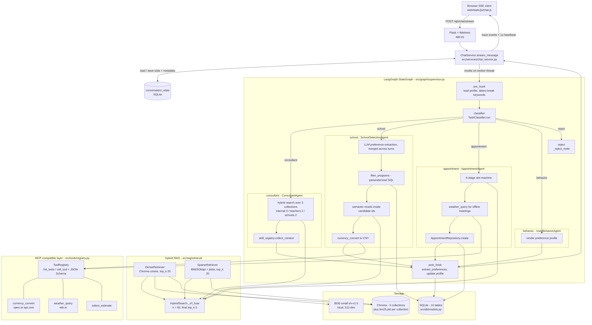
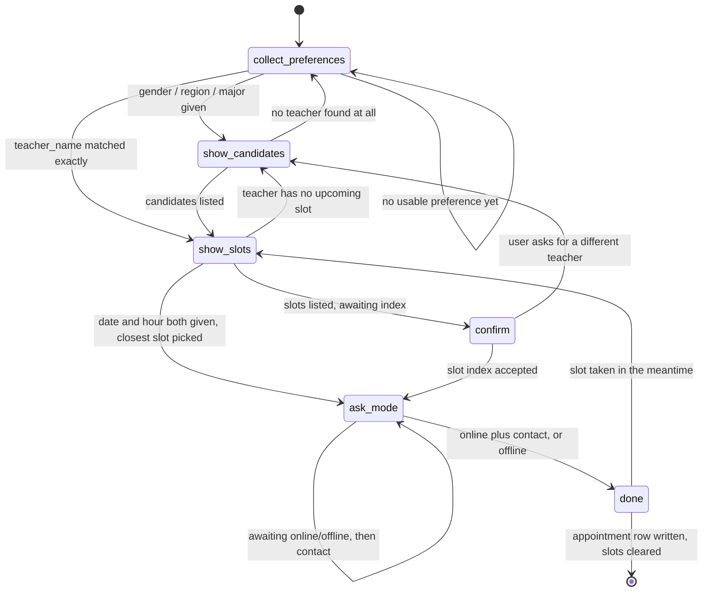

# Grad-School-Agent

[English](README.md) | **简体中文**

基于 LangGraph 的多 Agent 助手：在同一个对话窗口里回答留学问题、筛选硕士项目、预约咨询老师。


## Overview（项目概述）

申研本质上是一个披着对话外衣的信息检索问题：申请要求写在政策文档里，候选项目躺在关系表里，而老师的日程又在另一个地方。单一的检索增强对话机器人只能把第一类问题处理好，另外两类都会做砸。

本项目用 LangGraph 的 `StateGraph` 把工作拆给 5 个 Agent。分类器把每一轮输入路由到咨询 Agent（文档问答）、选校 Agent（结构化过滤 + 语义重排）、预约 Agent（6 阶段槽位填充状态机）或行为分析 Agent（偏好画像），并拒绝与业务无关的请求。检索走 Hybrid（BM25 + 稠密向量，用 RRF 融合），工具调用统一经过一个 MCP 兼容的注册中心，图中每一步都通过 SSE（Server-Sent Events，服务器推送事件）流式送到浏览器——推理路径是看得见的，而不是靠想象的。

这是一个自然语言处理课程项目，因此范围刻意收敛为本地优先：SQLite、落盘的 Chroma、本地 embedding 模型，`uv sync` 之后即可运行。不涉及部署、CI 和压测。

## Key Features（核心特性）

- **8 节点 `StateGraph` + 5 路条件边** —— `pre_hook` → `classifier` → `{consultant, school, appointment, behavior, reject}` 之一 → `post_hook` → `END`（`src/graph/supervisor.py`），偏好记忆的 hook 是图上的节点，而不是写在各 Agent 内部的调用。
- **Hybrid 检索 + RRF 融合** —— jieba 分词后的 BM25Okapi 与 Chroma 中的 BGE-small-zh-v1.5 稠密向量各召回 20 条，按 `1/(k + rank)`（`k = 60`）融合后取 Top-5（`src/rag/retrieval/hybrid_search.py`、`config/settings.yaml`）。
- **两段式项目检索** —— 先用参数化 SQL 在 `school_programs` 与 `schools` 的连接上筛出满足硬约束的候选集，再把语义重排*限制在*该集合内，通过 Chroma 的 `where={"program_id": {"$in": [...]}}` 实现（`src/db/repositories/school_repo.py:97`、`src/agents/school_selection_agent.py:180`）。
- **MCP 兼容工具层** —— 进程内的 `ToolRegistry` 暴露带 JSON Schema `inputSchema` 的 `list_tools()` / `call_tool()`，内置 3 个工具，并通过两个 HTTP 端点（`GET /api/mcp/tools`、`POST /api/mcp/call/<name>`）对外镜像 MCP SDK 的接口形态（`src/tools/registry.py`）。
- **6 阶段预约状态机 + 跨请求持久化** —— `collect_preferences` → `show_candidates` → `show_slots` → `confirm` → `ask_mode` → `done`，每轮结束后序列化写入独立的 `conversation_state` 表（`src/agents/appointment_agent.py:54`、`src/db/repositories/conversation_state_repo.py`）。
- **SSE 链路可观测 + 分层降级** —— 图在工作线程上运行，请求线程持续抽取共享 trace 列表并每 1 秒发一次心跳；稀疏索引、向量库、LLM 三处失败各自降级为更窄的路径，而不是抛异常（`src/services/chat_service.py:92`）。

## Architecture（架构）



请求路径是：`app.py` 接收 POST，`ChatService.stream_message` 先从 `conversation_state` 恢复上一轮的 `appointment_slots` 与 `metadata`，随后在守护线程上调用已编译的图，生成器则不断把共享的 `trace` 列表抽成 SSE 帧。`pre_hook` 注入用户画像，并在检测到显式打断词时清空进行中的多轮状态；`TaskClassifier` 在 5 个分支中选一个，同时会收到一段简短的 stage hint（阶段提示），使得预约流程中途的一个孤零零的 `"2"` 仍然留在预约分支上，而不会被重新分类。各专家 Agent 统一汇入 `post_hook`，由它从本轮对话重新抽取偏好并合并进 `user_profile`。`reject` 直接短路到 `END`——无关请求既不触发检索，也不写画像。

检索与工具访问是共享服务，而非各 Agent 各写一份：三个需要文档的 Agent 调用同一个 `HybridSearch`，两个需要实时数据的 Agent 调用同一个 `ToolRegistry`。

预约流程是唯一的有状态分支，其阶段随用户输入推进，每个 HTTP 请求只走一步：



两条捷径从主路径上砍掉了轮次：用户点名某位老师时，`collect_preferences` 直接跳到 `show_slots`；如果同一句话里已经带了手机号或微信号，`ask_mode` 直接跳到 `done`。二者都通过改写 `state["user_input"]` 并直接调用目标阶段来实现——转移表因此保持精简，代价是控制流稍微有点出人意料。

## Quick Start（快速开始）

**前置依赖** —— Python 3.10–3.12 与 [`uv`](https://docs.astral.sh/uv/)。需要一个 OpenAI 兼容的 LLM 端点；embedding 在本地运行。

```bash
# 1. 安装依赖（自动创建 .venv）
uv sync

# 2. 配置环境变量
cp .env.example .env          # Windows: copy .env.example .env

# 3. 建表并导入种子数据
uv run python -m src.db.init_db

# 4. 启动（Waitress，浏览器打开 http://127.0.0.1:5000）
uv run python app.py
```

`.env` 中的关键配置项（模板见 `.env.example`）：

| 变量 | 用途 |
|---|---|
| `LLM_PROVIDER` / `LLM_API_KEY` / `LLM_BASE_URL` / `LLM_MODEL` | OpenAI 兼容的 chat 端点。base URL 会被规范化为以 `/v1` 结尾（`src/agents/base_agent.py:45`）。 |
| `EMBEDDING_PROVIDER=local` / `EMBEDDING_LOCAL_MODEL` | 本地 sentence-transformers 模型，默认 `./models/bge-small-zh-v1.5`。该模型**不在**仓库中，首次摄取前需自行下载。 |
| `EXCHANGE_RATE_API_KEY`、`OPENWEATHER_API_KEY` | 可选。两个工具都优先走免 key 的公开 API，失败才回退到这些。 |
| `DB_PATH`、`CHROMA_PATH` | SQLite 文件与 Chroma 目录。 |

非敏感的默认参数（chunk 大小、`rrf_k`、各级 top-k、候选数量上限）放在 `config/settings.yaml`，不在 `.env` 里。

MCP 兼容工具服务可以脱离 UI 单独验证：

```bash
curl http://127.0.0.1:5000/api/mcp/tools

curl -X POST http://127.0.0.1:5000/api/mcp/call/currency_convert \
     -H 'Content-Type: application/json' \
     -d '{"amount": 60000, "from_currency": "USD", "to_currency": "CNY"}'
```

测试：`uv run pytest` —— `tests/unit/` 下 11 个文件共 36 个单元测试，覆盖 RRF 融合、切分器、chunk 构建、各 Repository、分类器与 post-hook 合并。

## Project Structure（目录结构）

```
app.py                          # Flask 入口：5 个页面 + 16 个 API 路由，__main__ 中启动 Waitress
config/
├── settings.yaml               # 非敏感默认值：检索、embedding、Agent 上限
└── prompts/                    # 5 个 prompt 模板，{占位符} 字符串替换（非 jinja2）
src/
├── agents/
│   ├── base_agent.py           # prompt 渲染、trace 辅助、LLM 客户端、JSON 抽取
│   ├── task_classifier.py      # 5 路路由 + 多轮 stage hint
│   ├── consultant_agent.py     # 跨 3 个 collection 的文档问答 + runtime skills
│   ├── school_selection_agent.py  # 偏好合并、SQL 过滤、语义重排、卡片渲染
│   ├── appointment_agent.py    # 6 阶段状态机
│   └── user_behavior_agent.py  # 画像抽取（post-hook）与渲染
├── graph/
│   ├── supervisor.py           # StateGraph 组装：8 节点、5 条条件边
│   ├── state.py                # GraphState / AppointmentSlots TypedDict
│   ├── hooks.py                # pre_hook（画像 + 打断词）、post_hook（写回画像）
│   └── appointment_graph.py    # 未使用的 subgraph 存根，抛 NotImplementedError
├── rag/
│   ├── collections.py          # 3 个 Chroma collection，cosine 空间
│   ├── ingestion/              # loader、RecursiveCharacterTextSplitter、Chroma + BM25 构建
│   └── retrieval/              # 稠密、稀疏、RRF 融合、带缓存的工厂
├── tools/
│   ├── registry.py             # MCP 兼容的 ToolRegistry + JSON Schema 表
│   ├── currency_tool.py        # open.er-api.com，1 小时缓存，静态回退表
│   ├── weather_tool.py         # wttr.in -> OpenWeather -> unavailable，10 分钟缓存
│   └── tuition_tool.py         # 年学费 x 学年数，并做汇率换算
├── runtime_skills/             # 插件机制：BaseRuntimeSkill + 自动发现的 registry
├── db/
│   ├── models.py               # 10 张 SQLAlchemy 表，每个字段都带 comment
│   ├── init_db.py              # create_all + 种子数据导入
│   └── repositories/           # 6 个 Repository，全部使用参数化 SQL
├── services/                   # ChatService（图 + SSE）、知识库、老师、行为分析
└── llm/                        # OpenAI 兼容 chat 客户端（tenacity 重试）、embedding 客户端
web/
├── templates/                  # 对话、老师管理、时间表、行为画像、知识库
└── static/                     # 原生 JS SSE 客户端，marked + DOMPurify 渲染 Markdown
data/
├── seed/                       # 50 所学校、70 个项目、20 位老师、840 个时间槽
└── raw_docs/internal/          # 25 篇中文知识库文档（签证、服务、文书）
docs/DB_SCHEMA.md               # 与 models.py 保持同步的 schema 参考
tests/unit/                     # 36 个测试
```

## Design Notes（关键设计决策）

**Hook 做成图节点，而不是写进 Agent。** 偏好记忆是横切关注点（cross-cutting concern）：每个分支进入时都需要画像，退出时都可能贡献画像。把 `pre_hook` / `post_hook` 塞进每个 Agent 会让逻辑重复 5 遍，也让「关闭记忆」变成 5 处改动；因此它们被做成普通的 `StateGraph` 节点，包在扇出分支的两侧（`src/graph/supervisor.py:46-57`）。代价是 `post_hook` 在*每一轮*都会多跑一次 LLM 抽取调用——包括那些其实什么也没学到的轮次；同时 `reject` 分支必须用一条自己的边显式绕过它直达 `END`。

**两段式检索，而不是一次向量查询。** 选校场景混合了硬约束（学费上限、QS 范围、雅思/托福门槛、学制）与模糊约束（专业方向、项目特色）。把整个请求 embedding 之后向 Chroma 要近邻，会召回一批「看起来很像但超预算」的项目——在这个任务里这是不可接受的失败模式。于是 `filter_programs` 用已有偏好拼出参数化的 `WHERE` 子句，返回至多 50 个 `program_id`，再把向量查询限制在这个集合内。硬约束由构造方式保证满足，语义只负责排序。代价同样真实：每轮两次往返；需要手工维护一张中文到 `major_category` 的别名表（`_MAJOR_ALIASES`），而不是用 embedding 做匹配；相关性上限被 SQL 的召回率卡死——过滤为空时，再强的语义检索也救不回来。最后这点靠渐进放宽缓解：先去掉 QS 范围，再去掉学费区间，然后才放弃。

**用 RRF 而不是分数归一化。** BM25 分数无界且依赖语料；余弦相似度则在完全不同的量纲上。任何加权求和都需要归一化常数，而这些常数还得按 collection 重新调。RRF（Reciprocal Rank Fusion，倒数排名融合）直接丢掉分数、只用排名来绕开这个问题——`score(d) = Σ 1/(k + rank)`，取 `k = 60`。它不需要调参，也不需要标注集，而本项目恰恰没有可供调参的相关性标注数据。代价是：一篇被两路检索器都以压倒性优势排到第一的文档，得分与勉强挤进来的那篇完全相同；幅度信息被丢弃了。`rrf_k` 写在 `config/settings.yaml` 而非硬编码，便于日后回头调整。

**用独立状态表，而不是 LangGraph 的 checkpoint。** 预约 Agent 是一台跨 HTTP 请求的状态机：第 *n* 轮列出三位候选，第 *n+1* 轮的输入就是一个字符 `2`。LangGraph 自带的 checkpointer 会持久化整个 `GraphState`，包括完整消息列表和所有检索到的 chunk。而真正需要跨轮存活的只有两个字段，所以 `conversation_state` 就只以 `conversation_id` 为键、用 JSON 文本存这两个字段（`src/db/models.py:88`），`ChatService` 在每次 invoke 前读、后写。这让持久化载荷保持小且人眼可读，代价是这一次手动保存绝不能忘——这个 bug 类别真实到被专门写进了项目的 `CLAUDE.md`。还有一个额外收益：因为阶段信息在图之外是已知的，分类器可以被*告知*用户当前处在哪个阶段，这正是 `_build_stage_hint` 注入路由 prompt 的内容，使得一个孤立的序号不会被误判为无关请求。

**MCP 形态的工具层，但跑在进程内。** 该注册中心刻意对齐 Anthropic MCP SDK 的接口形态——`list_tools()` 返回 `{name, description, inputSchema}`，`call_tool(name, **args)` 返回 dict——但运行在 Flask 进程内部，而非通过 stdio。真正的 MCP 传输能换来进程隔离与被其他客户端复用，代价是多一个进程、每次调用都要序列化、以及生命周期管理，而这些本应用都不需要。真正有价值的是接口兼容性：这三个工具可以被原样搬进独立的 stdio server，调用方一行都不用改。代码里对此也做了诚实标注——`PROTOCOL_VERSION = "mcp-like/0.1"`——而不是声称完整符合 MCP。

**降级，但绝不 500。** 每个外部依赖都有明确定义的失败模式，且 trace 会说清楚触发了哪一条。`bm25.pkl` 缺失或损坏时稀疏检索返回 `[]`，Hybrid 退化为纯稠密；选校 Agent 里 Chroma 失败则回退到 SQL 顺序；`currency_convert` 回退到 `settings.yaml` 里的静态汇率表；`weather_query` 依次尝试 wttr.in、OpenWeather，都失败则返回 `source: "unavailable"`；LLM 客户端仅对连接、超时、限流与 5xx 错误做 4 次指数退避重试，最终失败时往 trace 写一条告警而不是抛异常。代价是存在静默降级的可能——纯稠密的回答在用户眼里和 Hybrid 的一模一样，这正是每处降级都要发一条 trace 的原因。

**用 Waitress 而不是 Flask dev server。** Werkzeug 的开发服务器在 Windows 上做 chunked transfer 的长连接 SSE 时会断流。换成 Waitress（`threads=8`、`channel_timeout=300`）后问题消失；由于 Waitress 严格执行 PEP 3333，响应头里必须不带 `Connection`。图跑在守护线程上，因此在 LLM 调用阻塞期间生成器仍能每秒发一次心跳，避免浏览器在最慢的步骤上超时。

## Seed Data and Scale（种子数据与规模）

下表所有数字均来自 `data/seed/*.json` 与 `data/raw_docs/internal/`，由 `src/db/init_db.py` 导入。

| 项目 | 数量 | 出处 |
|---|---:|---|
| 学校 | 50 | `data/seed/schools.json` |
| 项目 | 70 | `data/seed/programs.json` |
| 咨询老师 | 20 | `data/seed/teachers.json` |
| 可预约时间槽 | 840 | `data/seed/teacher_schedule.json` |
| 知识库文档 | 25 | `data/raw_docs/internal/*.md` |
| SQLite 表 | 10 | `src/db/models.py` |
| Chroma collection | 3 | `src/rag/collections.py` |
| 单元测试 | 36 | `tests/unit/` |

尚未运行任何检索或端到端准确率基准测试。`.claude/skills/grad-school-eval/SKILL.md` 勾勒了 golden set 与 LLM-as-judge 的评估方案，但仓库中既没有提交 golden set，也不存在任何评分结果——因此这里不报告任何指标。

## Limitations and Roadmap（局限与后续计划）

- **没有量化评估。** 分类准确率、检索命中率、端到端任务成功率均无数据。上文描述的是机制，不是实测质量。
- **单用户。** `USER_ID = 1` 硬编码在 `app.py:39`，与 `config/settings.yaml` 中的 `ui.default_user_id` 对应。没有认证；对话连续性依赖 Flask session cookie。
- **`src/graph/appointment_graph.py` 是存根。** 设计文档原本打算把预约流程做成 LangGraph 子图，实际实现为 Agent 内部的状态机，而该存根仍然抛 `NotImplementedError`，应当删除或补完。
- **只存在一个 runtime skill。** `us_visa_knowledge` 是关键词匹配 + 硬编码字符串。插件机制（自动发现、`match` / `provide_context`）已完整，内容库尚未建立，且目前只有 `ConsultantAgent` 调用 `collect_context`。
- **阶段转移依赖正则与关键词匹配。** 时段选择用 `re.search(r"[1-5]", ...)`，会面形式用关键词列表匹配，联系方式用手机号/微信正则。对演示流程足够稳健，对自由表述则较脆弱。
- **embedding 模型未随仓库分发。** `models/` 已被 gitignore（BGE 检查点在磁盘上约 180 MB）；在本地下载之前检索会失败。
- **Chroma 的 metadata 过滤被部分重实现。** 稀疏结果在 Python 侧由 `_filter_by_where` 过滤，仅支持 `$in` 与等值——与 Chroma 自身的过滤语义存在偏离，一旦用到更丰富的操作符就会暴露。
- **工具调用是硬编码的，不由 LLM 选择。** `inputSchema` 已是 MCP 形态、可直接用于 function calling，但各 Agent 是在固定位置调用 `registry.call_tool(...)`，而非让模型自行挑选工具。
- **缺少 LICENSE 文件。** `pyproject.toml` 声明为 MIT，但许可证正文未提交。

## Acknowledgements（致谢与自研增量）

本项目基于开源项目 **smart-appointment-ai-agent**（一个按摩门店的智能预约助手）重构而来。它提供了经过验证的工程骨架：四 Agent 划分（任务分类 / 预约 / 咨询 / 用户行为）、service 分层，以及数据库之上的 Repository 模式。这一渊源记录在 `DEV_SPEC.md` 1.2 节。

在把骨架迁移到新领域之外，本项目新增的部分是：

- **`SchoolSelectionAgent`** 及其背后的「SQL 硬过滤 → 语义重排」两段式检索策略，包括 `schools` / `school_programs` 父子表 schema。
- **MCP 兼容工具层** —— 带 `list_tools()` / `call_tool()` 的 `ToolRegistry`、JSON Schema 描述，以及对外暴露它的两个 HTTP 端点。
- **Runtime Skills 插件机制** —— `BaseRuntimeSkill`、自动发现的 `SkillRegistry`，以及 prompt 期的上下文注入。
- **SSE 可观测链路** —— 逐节点的 trace 发射、带心跳的多线程图执行，以及浏览器侧的工作流视图。
- **Hybrid RAG** —— BM25 + 稠密向量 + RRF 的检索栈，配合本地 BGE embedding。
- **`conversation_state`** —— 为多轮预约状态机提供的跨请求持久化。

`DEV_SPEC.md` 是 v1.0 设计稿，多处已被实现推翻：它写的是 Streamlit，实际代码是 Flask + Waitress；它写 7 张表，实际是 10 张；它声明本期不实现 MCP，而兼容层已经存在。两者冲突时，以代码为准。
