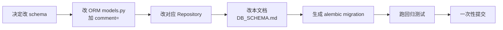

# 数据库 Schema 文档

> 本文档与 [`src/db/models.py`](../src/db/models.py) 实时同步。任何 schema 变更（加字段/改类型/加表）必须在**同一次提交**更新本文件，否则视为未完成。详见 [`DEV_SPEC.md` 附录 A](../DEV_SPEC.md#附录-a数据库-schema-同步规范)。
>
> 数据库类型：SQLite (本地单文件 `data/grad_school.db`)
> ORM：SQLAlchemy 2.0 风格

## 表清单

| 表名 | 用途 | 主要消费者 |
|------|------|----------|
| [`users`](#users) | 用户基础信息 | 所有 Agent / UI |
| [`user_profile`](#user_profile) | 用户画像（偏好记忆） | UserBehaviorAgent / pre-hook / post-hook |
| [`conversations`](#conversations) | 对话会话 | ChatService |
| [`messages`](#messages) | 单条消息（带 agent_name） | ChatService / 对话页面 |
| [`teachers`](#teachers) | 咨询老师 | AppointmentAgent / TeacherService |
| [`teacher_schedule`](#teacher_schedule) | 老师时间槽 | AppointmentAgent / 时间表页面 |
| [`appointments`](#appointments) | 预约订单 | AppointmentAgent |
| [`schools`](#schools) | 学校（父级） | SchoolSelectionAgent |
| [`school_programs`](#school_programs) | 学校项目（子级） | SchoolSelectionAgent（两段式检索） |

---

## users

用户基础信息。课程项目阶段为单用户简单模型，默认 `id=1`。

| 字段 | 类型 | 约束 | 说明 |
|------|------|------|------|
| `id` | INTEGER | PK | 用户 ID |
| `username` | VARCHAR(64) | UNIQUE NOT NULL | 用户名 |
| `created_at` | DATETIME | 默认 now | 创建时间 |

---

## user_profile

用户画像。由 post-hook 异步抽取并合并的偏好信息。

| 字段 | 类型 | 约束 | 说明 |
|------|------|------|------|
| `user_id` | INTEGER | PK / FK→users.id | 用户 ID |
| `preferences` | JSON | 默认 `{}` | 偏好 JSON（见下方 schema） |
| `memory_enabled` | BOOLEAN | NOT NULL，默认 TRUE | 是否启用偏好记忆。`FALSE` 时 pre/post hook 全部跳过 |
| `updated_at` | DATETIME | 默认 now，自动更新 | 最后更新时间 |

### `preferences` JSON 结构

```json
{
  "interested_countries": ["美国", "英国"],
  "interested_majors": ["CS", "DS"],
  "tuition_range_usd": [80000, 150000],
  "qs_rank_range": [1, 50],
  "gender_preference_for_teacher": "female",
  "keywords": ["留学奖学金", "实习背景"]
}
```

字段缺失时默认值为 `null` 或空数组。

---

## conversations

对话会话。点击 UI "清空对话" 会开新一行。

| 字段 | 类型 | 约束 | 说明 |
|------|------|------|------|
| `id` | INTEGER | PK | 会话 ID |
| `user_id` | INTEGER | FK→users.id NOT NULL | 所属用户 |
| `started_at` | DATETIME | 默认 now | 开始时间 |

---

## messages

单条消息。`agent_name` 字段便于在 UI 上展示「这条消息来自哪个 Agent」。

| 字段 | 类型 | 约束 | 说明 |
|------|------|------|------|
| `id` | INTEGER | PK | 消息 ID |
| `conversation_id` | INTEGER | FK→conversations.id NOT NULL | 所属会话 |
| `role` | VARCHAR(16) | NOT NULL | `user` / `assistant` / `system` |
| `agent_name` | VARCHAR(32) | NULL | `task_classifier` / `consultant` / `school_selection` / `appointment` / `user_behavior`（user 消息为空） |
| `content` | TEXT | NOT NULL | 消息正文 |
| `created_at` | DATETIME | 默认 now | 创建时间 |

---

## teachers

咨询老师。结构化字段进入 SQLite，自由文本（bio）同时进 Chroma `teachers` collection。

| 字段 | 类型 | 约束 | 说明 |
|------|------|------|------|
| `id` | INTEGER | PK | 老师 ID |
| `name` | VARCHAR(64) | NOT NULL | 姓名 |
| `gender` | VARCHAR(8) | NOT NULL | `male` / `female` / `other` |
| `bio` | TEXT | NULL | 简介（自由文本） |
| `study_abroad` | VARCHAR(255) | NULL | 留学经历摘要（如 `MIT MS in CS, 2018-2020`） |
| `work_experience` | TEXT | NULL | 工作经历摘要 |
| `expertise_regions` | VARCHAR(255) | NULL | 擅长地区，逗号分隔（如 `美国,英国,加拿大`） |
| `expertise_majors` | VARCHAR(255) | NULL | 擅长专业，逗号分隔（如 `CS,EE,DS`） |
| `avatar_url` | VARCHAR(255) | NULL | 头像 URL |
| `rating` | FLOAT | NULL | 评分（如 `4.8`） |

**变更记录**（2026-05-29）：
- 新增 `avatar_url`、`rating`

---

## teacher_schedule

老师可预约时间槽。由管理员/老师批量录入。

| 字段 | 类型 | 约束 | 说明 |
|------|------|------|------|
| `id` | INTEGER | PK | 时间槽 ID |
| `teacher_id` | INTEGER | FK→teachers.id NOT NULL | 老师 ID |
| `date` | VARCHAR(10) | NOT NULL | 日期 `YYYY-MM-DD` |
| `time_slot` | VARCHAR(16) | NOT NULL | 时间段（如 `14:00-15:00`） |
| `status` | VARCHAR(16) | NOT NULL，默认 `available` | `available` / `booked` / `blocked` |

---

## appointments

预约订单。AppointmentAgent 在用户确认后写入；同事务内更新对应 `teacher_schedule.status='booked'`。

| 字段 | 类型 | 约束 | 说明 |
|------|------|------|------|
| `id` | INTEGER | PK | 预约 ID（即订单号） |
| `user_id` | INTEGER | FK→users.id NOT NULL | 预约用户 |
| `teacher_id` | INTEGER | FK→teachers.id NOT NULL | 预约老师 |
| `schedule_id` | INTEGER | FK→teacher_schedule.id NOT NULL | 预约的时间槽 |
| `topic` | TEXT | NULL | 预约话题（用户填写） |
| `status` | VARCHAR(16) | NOT NULL，默认 `confirmed` | `pending` / `confirmed` / `cancelled` |
| `created_at` | DATETIME | 默认 now | 创建时间 |

---

## schools

学校（父级）。一所学校下挂多个 `school_programs`。

| 字段 | 类型 | 约束 | 说明 |
|------|------|------|------|
| `id` | INTEGER | PK | 学校 ID |
| `names` | JSON | NOT NULL | 名称变体数组，含中英文全称、简称等 |
| `country` | VARCHAR(32) | NOT NULL | 所在国家（中文） |
| `country_en` | VARCHAR(32) | NULL | 所在国家（英文） |
| `city` | VARCHAR(64) | NULL | 所在城市 |
| `address` | VARCHAR(255) | NULL | 详细地址 |
| `qs_rank` | INTEGER | NULL | QS 综合排名（未排名为 `NULL`） |
| `official_site` | VARCHAR(255) | NULL | 官网 URL |
| `intro` | TEXT | NULL | 学校总介绍（短摘要；详细介绍进入 Chroma `schools` collection） |
| `created_at` | DATETIME | 默认 now | 创建时间 |

**变更记录**（2026-05-29）：
- `name` → `names`（JSON 数组）
- 删除 `short_name`（并入 `names`）
- 新增 `country_en`、`city`、`address`

---

## school_programs

学校项目（子级）。一所学校下有多个项目，每个项目学制/学费各异。这是 SchoolSelectionAgent **两段式检索的"第一段（SQL 过滤）"** 目标表。

| 字段 | 类型 | 约束 | 说明 |
|------|------|------|------|
| `id` | INTEGER | PK | 项目 ID |
| `school_id` | INTEGER | FK→schools.id NOT NULL | 所属学校 |
| `program_names` | JSON | NOT NULL | 项目中英文全称 |
| `program_short_names` | JSON | NULL | 项目多简称变体 |
| `tags` | JSON | NULL | 分类标签（如 `["CS", "AI", "泛计算机"]`） |
| `major_category` | VARCHAR(32) | NOT NULL | 专业大类：`CS` / `EE` / `DS` / `Business` / `其他` |
| `duration_months` | INTEGER | NOT NULL | 学制（月） |
| `tuition_per_year` | FLOAT | NOT NULL | 学费/年（数值） |
| `currency` | VARCHAR(8) | NOT NULL，默认 `USD` | 币种（`USD` / `GBP` / `CNY` 等） |
| `ielts_min` | FLOAT | NULL | 雅思最低要求（如 `7.0`） |
| `toefl_min` | FLOAT | NULL | 托福最低要求（如 `100`） |
| `program_url` | VARCHAR(255) | NULL | 学院官网项目链接 |
| `description_short` | TEXT | NULL | 项目简介（详细描述进入 Chroma `schools` collection） |
| `created_at` | DATETIME | 默认 now | 创建时间 |

**变更记录**（2026-05-29）：
- `program_full_name` → `program_names`（JSON）
- `program_short_name` → `program_short_names`（JSON）
- 删除 `deadline`
- 新增 `tags`、`program_url`

---

## 维护流程



任何省略 D 或 G 的改动都不合规。用 `grad-school-db` skill 辅助完整流程。
